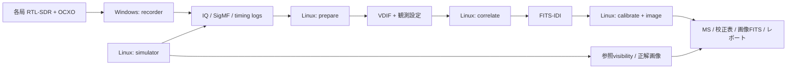

# Windows収録・Linux処理による実運用構成の概算設計

作成日：2026-10-02。資料調査と計算に基づく初期設計。実機・候補ソフトの動作確認、ベンチマーク、購入機種の選定は行っていない。PC要件は設計上の目安であり、実測で確認した最低要件ではない。

その後の設計整理：Windows収録ソフトによる直接VDIF保存＋付随メタデータも有効な候補とする。以下のIQ/SigMF→LinuxでVDIF変換は選択肢であり必須ではない。GPSDO/PPSとサンプル時刻の対応を設計してから方式を確定する。現在の構想・開発順序は [初期レポート](../reports/000-initial-plan.md) を参照。

## 1. 前提と推奨構成

確定している条件は、OCXO改造RTL-SDR、Cas A、観測周波数1.42 GHz、最大基線長約600 m。未確定の局数・時間等には、次の仮定を置く。

| 条件 | 概算用の仮定 |
| --- | --- |
| 局数 | 基準4局、拡張8局。1局につき受信機1台・WindowsノートPC1台 |
| 収録時間 | 1回4時間 |
| サンプルレート | 各局2.048 MS/s（複素サンプル毎秒）。2.4 MS/sも容量比較 |
| データ | 単一偏波、8 bit I + 8 bit Q = 2 bytes/複素サンプル |
| 相関 | 1024チャネル、1偏波積、相互相関と自己相関を保存 |
| 保存積分時間 | 時計・位相補正後の1秒を容量計算の基準。初期確認は0.01～0.1秒の短区間 |
| 単位 | MB/GB/TBは10進。MiB/GiBは2進。1.42 GHzはRF中心周波数であり収録帯域ではない |

局ごとにローカルSSDへ収録し、観測後にLinuxへ集約する。Windows側は収録と品質監視を担当し、Linux側にVDIF変換、相関、較正、画像復元、シミュレーションを置く。VDIFを相関器との標準境界、FITS-IDIを相関結果の保存境界として維持する。

WindowsからLinuxへ渡す最初の境界は、未加工IQ＋SigMF＋補足JSONを推奨する。収録原本と時刻推定を切り離すことで、時計モデルや量子化の扱いを変更しても再変換できる。収録ソフトに直接VDIF出力を追加する選択肢も残すが、最初は同じLinux変換器を実データと模擬データの両方に使う。

## 2. ソフトウェアの分割



| ソフト | 実行場所・責務 | 主な入出力・流用候補 |
| --- | --- | --- |
| recorder | Windowsネイティブ。機器設定、連続収録、低頻度のスペクトル監視、ログ | 観測JSON→IQ/SigMF/ログ。librtlsdrまたはpyrtlsdr。ドライバーと改造機の適合は要確認。[1] |
| prepare | Linux。原本確認、時計情報整理、必要なリサンプリング、VDIF変換、局設定生成 | IQ＋メタデータ→VDIF＋時計モデル＋VEX/v2d等。Baseband/vdifioを利用。[2] |
| correlate | Linux。既製相関器を呼ぶ薄いラッパー。自作方式も差し替え可能にする | VDIF＋観測設定→専用相関出力→FITS-IDI。DiFX系、SFXC系、LSL系 |
| calibrate / image | Linux。較正と画像化を別コマンドとして実行し、同じ処理環境で連携 | FITS-IDI→MS→校正表→画像FITS。CASAを基準に、画像化をWSCleanへ差し替え可能。[3][4] |
| simulator | Linux。visibility参照値と模擬IQの生成 | 天体・局・受信機設定→模擬IQ/SigMF＋参照visibility。visibilityのみの高速評価も別モードにする |
| run管理 | Linux。入力検査、処理状態、版・条件の記録、結果比較 | manifestと各段階の結果JSON。重い処理の内部実装とは分離する |

外部ソフトを使う場合も、本プロジェクトの入口・出口とrun記録を揃える。Python環境・コンテナ等は工程ごとに版を固定できる構成とし、全候補を一つの環境へ混在させない。単一リポジトリで管理し、今後 `src/recorder/`、`src/preprocess/` 等を追加する想定。本設計ではアプリケーション実装は行わない。

## 3. ファイルによるインターフェース

### 3.1 Windows→Linux：観測パッケージ

1観測に共通の `session_id`、局ごとの `station_id`、連続受信区間ごとの `segment_id` を付ける。セッションIDに計画UTCを含めても、実サンプル時刻の証拠とは扱わない。

```text
<session_id>/
  observation.json             # 全局共通：天体、RF、計画、schema_version
  stations/
    ST01/
      receiver.json            # 機種、serial、ゲイン、OCXO、設定値、ソフト版
      station.json             # 局座標・座標系・測定元・誤差、偏波・アンテナ
      segments.json            # 連続区間、各ファイルの順番・サンプル数
      timing.json              # 時刻観測、推定値・不確かさ、時計モデル
      events.jsonl             # USB/収録エラー、設定変更、既知/疑いの欠損
      chunks/
        seg0001_000000.sigmf-data
        seg0001_000000.sigmf-meta
        seg0001_000001.sigmf-data
        seg0001_000001.sigmf-meta
      manifest.json            # 相対パス、byte数、SHA-256、完了状態
```

IQはSigMFの `cu8`、`I0,Q0,I1,Q1,...` を使い、受信したbyte列を保持する。SigMFは複素unsigned 8 bitとこの並びを定義している。[5] 値の中心・符号変換・正規化はprepareで明示して行い、原本を変更しない。

初期設定は60秒単位のファイル分割。1ファイル約245.76 MB、1局4時間で240ファイル。各ファイル内のSigMFサンプル番号はローカル番号、セグメント全体の番号はsegments.jsonで対応させる。番号・サンプル数は64 bit整数で管理する。

全体の時刻と品質は次の規約で渡す。

| 情報 | 規約案 |
| --- | --- |
| 時刻 | UTCのISO 8601（末尾Z）＋サンプル番号。計算内部は時刻ライブラリの高精度表現。UTC/TAI変換と閏秒を扱う |
| 時刻の意味 | `host_usb_receive`、`gnss_pps`、`sample_anchor_estimate` 等を分離し、測定法・不確かさ・適用範囲を記録 |
| SigMF datetime | 実サンプル時刻として扱える対応がある場合に記載。単なるPC受信時刻を代入しない |
| 時計モデル | 連続区間ごとに `t(n)=t0+n/f_eff` を基準とし、必要なら区分的モデル。設定Fsと推定実Fsは別々に保存 |
| 周波数・偏波 | RF中心Hz、サンプルレートHz、LO/周波数補正値、スペクトル向き、アンテナ偏波・方向。単一偏波を無条件にStokes Iとしない |
| 局位置 | ITRF/ECEFのm単位等、座標系・epoch・測定誤差を記録。GNSSの楕円体高と標高を混同しない |
| 欠損 | 確認できた欠損と疑いを区別。欠損数不明はunknown。単なる返却サンプル数だけで連続性を保証しない |
| 版 | schema_version、プログラム版/コミット、観測設定のハッシュ。補足JSONは本プロジェクトの仕様とし、SigMF標準項目と混同しない |

標準RTL-SDRのAPIはサンプル対応のハードウェア時刻を渡さない。[6] そのため、開始時刻・サンプルレート差・LO差の推定は独立した作業項目。Windows時計の同期と、局間サンプル・位相の同期を区別する。共通信号や天体による粗い遅延探索などの具体的手段は別設計とする。

収録中は `.partial` へ書き、書込み完了後に同一ディレクトリで正式名へ変更する。ファイルclose後にSHA-256を計算し、ディスク負荷を監視して並列度を制限する。途中終了したファイルは完了品とは区別し、全複素サンプル単位の長さ等を検査して救済する。manifestの完了とLinux側のchecksum確認を受渡し完了条件にする。

### 3.2 prepare→correlate：VDIF＋観測設定

- 一局・一偏波・一threadを初期の最小構成とする。
- 8 bit I + 8 bit Qを基本とし、安易な2 bit再量子化は初期段階では行わない。採用相関器との互換性は別途確認する。
- 概算用フレーム案：32 byteヘッダー＋8192 byte payload＝8224 byte、4096複素サンプル/frame。Fs=2.048 MS/sなら500 frame/s、2 ms/frame。EDVや実際のframe条件は互換性確認後に確定する。[2]
- UTC秒境界への整合と端数処理を規定する。時刻を推定した場合はその不確かさと残留時計差を補足モデルへ残す。フレームヘッダーだけで正確な時刻が測定できたと判断しない。
- 既知の無効区間・欠損を無効フレーム等へ反映し、データを詰めて以降の時刻を変えない。位置不明の欠損は別区間・品質制限として扱う。
- prepareで補正した時計・サンプルレートと、相関器へ渡す残留補正を記録し、二重補正を防ぐ。
- 小さなJSON/YAMLの共通設定から、DiFXのVEX/v2d等またはSFXC制御形式を生成する。パスを含む実行設定は計算機側で解決し、観測原本の識別情報は相対パスとハッシュで保つ。

### 3.3 correlate→calibrate→image

相関結果の交換・保存はFITS-IDIとする。内部専用相関出力も、再出力に必要な設定とともに作業領域に置く。CASAはFITS-IDIをMSへ読み込み、WSCleanもMSを用いるため、較正以降の作業形式はMSとする。[3][4]

FITS-IDI、MS、校正表、画像FITS、フラグ、実行条件をひとまとまりで保存する。UVWの単位・基線向き、複素共役、積分中央時刻、周波数順序、偏波、振幅規約と重みを各段階で引き継ぐ。相関器・量子化に依存する補正も実行記録へ残す。

結果は `<session_id>/<run_id>/<stage>/` に分け、入力checksum＋設定＋ソフト版を記録する。既存runを上書きせず、条件変更は新runとして再計算する。FITS-IDI単体では校正表・履歴を完全に代替できないため、MSと校正記録も管理する。

## 4. 容量の概算

### 4.1 IQとVDIF

```text
IQ速度 = Fs × (Iのbit数 + Qのbit数) / 8
総容量 = IQ速度 × 秒数 × 局数 × 偏波ストリーム数
VDIF倍率 = 1 + header_bytes / payload_bytes
```

Fs=2.048 MS/s、I8+Q8では1局4.096 MB/s＝32.768 Mbit/s、14.7456 GB/時。上記VDIF案のヘッダー増分は0.390625%。メタデータ・filesystem overheadはこの表に含めない。

| 局数 | 全局IQ入力速度 | IQ 4時間 | VDIF 4時間 | IQ＋VDIF |
| --- | ---: | ---: | ---: | ---: |
| 1 | 4.10 MB/s | 58.98 GB | 59.21 GB | 118.20 GB |
| 2 | 8.19 MB/s | 117.96 GB | 118.43 GB | 236.39 GB |
| 4 | 16.38 MB/s | 235.93 GB | 236.85 GB | 472.78 GB |
| 8 | 32.77 MB/s | 471.86 GB | 473.70 GB | 945.56 GB |

2.4 MS/sなら1局4.8 MB/s、17.28 GB/時、4時間69.12 GB、8局で552.96 GB。2偏波はIQ容量が2倍、全4偏波積を相関・保存する場合はvisibility容量が概ね4倍となる。

元の8 bit IQをcomplex64（I/Q各float32）として丸ごと保存すると4倍、complex128では8倍。8局4時間のcomplex64は約1.887 TB。処理内部で必要なブロックだけfloatへ展開する。雑音中心のIQは圧縮率を事前に当てにしない。

### 4.2 visibilityと画像

相互基線数 `Nb=N(N-1)/2`。自己相関を含めると保存積数 `Np=Nb+N`。一積・一チャネルにcomplex64 8 byte＋weight float32 4 byte＋flag 1 byteを仮定すると、データ要素の下限的な概算は次になる。

```text
visibility容量 ≈ Np × チャネル数 × (観測秒数/積分秒数) × 13 byte
```

これは実際のFITS-IDI/MSのファイルサイズではなく、メタデータ、複数weight/sigma列、校正済み列、索引、ファイル配置を省いた計算。FITS-IDIのフラグ表現もこの1 byteモデルと同一ではない。

| 局数 | 相互基線 | 自己込み積数 | 1024ch・1秒・4時間の要素概算 | IDI/MS/校正/作業コピーの確保目安 |
| --- | ---: | ---: | ---: | ---: |
| 2 | 1 | 3 | 0.58 GB | 3～10 GB |
| 4 | 6 | 10 | 1.92 GB | 10～30 GB |
| 8 | 28 | 36 | 6.90 GB | 30～100 GB |

チャネル幅は2.048 MHz/1024＝2 kHz。積分0.1秒なら表の要素概算は10倍、0.01秒なら100倍。8局・4時間・0.01秒で要素だけでも約690 GBとなり、MSの複数列・コピーを含めると2 TB作業SSDでは足りなくなる可能性がある。初期の短積分確認は短い観測区間を使い、時計・レート補正を検証してから長時間の保存積分を決める。

残留周波数差がある状態で先に長く平均すると相関が消える場合がある。長積分による削減は較正後に回復可能かを確認して行う。

512×512のfloat32画像1枚は約1.05 MB。1024チャネルの512×512 cubeは約1.07 GB/列。dirty、PSF、model、residual等を含む画像処理中の容量は増えるが、連続波画像数枚はIQより小さい。

### 4.3 作業用と保存用のディスク

| 用途 | 初期4局・4時間 | 拡張8局・4時間 |
| --- | --- | --- |
| 各Windowsノートの収録先 | SSDで100 GB以上の空き。1回のIQは約59 GB | 各局の必要量は同じ |
| Linux作業用 | SSD 1 TB程度。IQ＋VDIF＋後処理の1観測に余裕を確保 | SSD 2 TB程度。約946 GB＋後処理・余裕。短積分全時間保存や複数観測同時処理は別見積り |
| 別媒体の原本保存 | 1観測約236 GB＋メタデータ | 1観測約472 GB＋メタデータ |
| 10回分のIQ原本だけ | 約2.36 TB | 約4.72 TB |

容量に25%以上の運用余裕を加え、バックアップは別媒体として数える。原本を保ったまま再生成可能なVDIF・一時MSを後で整理する運用は可能だが、削除方針は別途決める。

大容量データはGitリポジトリ外に置く。Windowsは例として `D:\VSoRA\observations\`、Linuxは `/srv/vsora/archive/` と `/srv/vsora/work/` を使う。これらは提案パスであり本設計では作成しない。Gitにはコード、設定、manifest、文献、検証レポート、小容量の参照データを置く。

## 5. 搬送とネットワーク

基本は収録をローカルSSDで完結させ、終了後にEthernetまたは外付けSSDで搬送する。ネットワーク接続は収録継続の必須条件にしない。両OSから読み書きする搬送SSDにはexFAT等を候補とし、checksumで確認する。

以下は転送速度を仮定した計算。通信・SSDの実測値ではなく、metadata処理やハッシュ計算・追加コピーの時間も含まない。

| 集約速度の仮定 | 4局IQ 約236 GB | 8局IQ 約472 GB |
| --- | ---: | ---: |
| 10 MB/s（100 Mbit/s級の例） | 約6.6時間 | 約13.1時間 |
| 100 MB/s（1 Gbit/s級の例） | 約39分 | 約79分 |
| 250 MB/s（2.5 Gbit/s級／SSD搬送の例） | 約16分 | 約31分 |

各局1回分約59 GBを100 MB/sでコピーする計算は約10分。外付けSSDに集めた後Linuxへ再コピーするなら、そのコピー時間も加わる。

8局をリアルタイム搬送するデータ量は約262 Mbit/sで、1 Gbit/sの公称容量には収まる。ただし観測地点のネットワーク条件と転送途絶を考慮すると、初期は観測後集約が扱いやすい。SSH/SFTP等の再開できる搬送手段とmanifestによる重複・欠落検査を用いる。制御情報はJSON＋ログで十分で、最初から専用ストリーミングプロトコルを作る必要はない。

## 6. 計算量・RAM・GPUの目安

### 6.1 相関の算術量

重なりなし1024点複素FFT＋全相互基線の相互乗算に簡略化する。複素FFTを約 `5L log2(L)` FLOP、複素積和を約8 FLOPと数えると、実時間1秒当たりの概算は次になる。

| 局数 | FFT | 相互相関の積和 | 合計（概算） |
| --- | ---: | ---: | ---: |
| 4 | 0.410 GFLOP/s | 0.098 GFLOP/s | 0.508 GFLOP/s |
| 8 | 0.819 GFLOP/s | 0.459 GFLOP/s | 1.278 GFLOP/s |

自己相関、PFB、窓、補間・遅延補正、フリンジ回転、探索、I/O、MPI通信は含まない。重ね合わせFFT、探索窓数、多位相中心、再相関があれば増える。これはソフトの速度や実時間処理の保証ではないが、この帯域・局数ならCPU方式を比較基準に置く価値があるという設計判断になる。

標準DiFXはCPU/MPI系の構成を基準にする。[7] GPUを搭載しても、この経路が自動でGPUへ移るわけではない。GPUを使う場合はxGPUを組み込む自作FX、CuPy等を用いた模擬IQ生成、OSKAR、対応するWSCleanのIDG等を明示的に選ぶ。xGPUは相互乗算部品であり、WSCleanのGPU gridderも追加ライブラリを要する。[4][8]

### 6.2 RAMとVRAM

8局×1秒のcomplex64電圧バッファは約125 MiB。二重バッファ・FFT作業領域・出力を足しても、ブロック処理にすれば4時間全量をRAMへ読み込む必要はない。実際のMPI構成、ライブラリのコピーやCASA作業列のメモリ利用は別途確認する。

大きな模擬IQもチャンク生成する。8局の30秒IQは約0.98 GB（cu8）、60秒は約1.97 GB。既知visibilityから局ごとの電圧を生成する方法と、空の多数成分を時間領域で直接足す方法では計算量が大きく異なり、IQシミュレーターの計算方式は別設計が必要。

### 6.3 PC構成の設計目安

| PC | 初期に評価する構成 | 余裕を見た構成 | 根拠・注意 |
| --- | --- | --- | --- |
| 各局Windows収録PC | 現行相当の4 CPUコア、RAM 8 GB、ローカルSSD、適合USBドライバー | RAM 16 GB、SSD 512 GB級で100 GB以上空き、安定した電源 | 1台分の書込みは約4.1 MB/s。GHzやGPUより欠落なく連続収録できることを確認 |
| 4局Linux処理PC | 8 CPUコア程度、RAM 32 GB、作業SSD 1 TB、1 Gbit/s接続 | 12～16 CPUコア、RAM 64 GB、作業SSD 2 TB | 相関・較正・画像化を同時に走らせる量と処理期限で変わる |
| 8局Linux処理PC | 12～16 CPUコア程度、RAM 32～64 GB、作業SSD 2 TB | RAM 64 GB、複数観測分の別保存媒体、2.5 Gbit/s接続 | 8局入力は約32.8 MB/s。2倍実時間処理を目標にすると入力読出しは約65.5 MB/s |
| Linux GPU | CPU基準経路では必須にしない。既存GPUから対応状況を調べる | CUDA系を選ぶならNVIDIA系・VRAM 8～12 GB程度を初期検討枠 | VRAM値は簡易IQバッファからの目安。実装と同時処理で変わり、最低要件や購入推奨ではない |

Windows側の目標：連続書込みを実際の収録速度の5倍程度（約20 MB/s以上）で扱える余裕と、USB・ドライバー・収録ソフトを含めた長時間の連続性確認。ピークSSD速度だけで判断しない。収録中のスリープ防止・電源管理も運用設定へ含める。

相関・変換・画像化の正確な処理時間は未算出。理論FLOPとCPUコア数・GPU型番だけから保証できない。後で同じ10分データ（8局IQ約19.7 GB）を処理し、中央値・最大RAM/VRAM・ディスク速度・実時間比を比較する。実時間の2倍以上の処理速度が得られれば、4時間観測を約2時間以下で相関する目標の判断材料になるが、粗い時計探索・較正・画像化・データ搬送時間は別に加算する。

## 7. シミュレーターとの共通化

1. visibilityモード：局配置と天体モデルから参照visibilityを生成し、画像復元性能を速く評価する。
2. IQモード：同じ設定から受信機ごとの確率的電圧を生成し、LO差、時計差、サンプルレート差、ノイズ、量子化、欠損を注入する。recorderと同じ観測パッケージを出力する。
3. 模擬IQを実データと同じprepare・correlateへ渡し、参照visibilityと比較する。各工程を共通化しつつ、参照値には独立した計算系を選んで同じ誤りを見逃しにくくする。
4. 最初のIQ試験は10～60秒など短い区間で行う。地球自転による長時間uv被覆・画像評価はvisibilityモードで行い、必要な試験だけ長時間IQへ拡張する。

## 8. 今後確定する項目

局数、各局の受信機モデル、OCXOとADC/LOの接続、時刻同期方法、観測時間、帯域、偏波、局配置、アンテナと感度、既存Linux機のCPU/RAM/GPU、処理期限、原本保持期間。これらが決まれば容量・PC要件を更新する。

本設計の最優先の未解決点は実サンプルの時刻・周波数・位相の管理。Windows/Linuxの分割やファイル形式だけでは解決しない。候補の接続試験・実機検証は今後の個別指示に応じて行う。

## 参照資料

- [1] [pyrtlsdr：Windowsを含む導入方法とlibrtlsdrラッパー](https://github.com/pyrtlsdr/pyrtlsdr)
- [2] [Baseband：VDIFのヘッダーと入出力](https://baseband.readthedocs.io/en/stable/vdif/index.html)
- [3] [CASA：FITS-IDI→Measurement Set](https://casadocs.readthedocs.io/en/stable/api/tt/casatasks.data.importfitsidi.html)
- [4] [WSClean：構築とGPU gridder依存](https://wsclean.readthedocs.io/en/latest/installation.html)、[MS入力](https://wsclean.readthedocs.io/en/latest/usage.html)
- [5] [SigMF公式仕様：cu8・I/Q順序・メタデータ](https://sigmf.org/)
- [6] [Osmocom：librtlsdr API](https://github.com/osmocom/rtl-sdr/blob/master/include/rtl-sdr.h)
- [7] [DiFX：MPI等の依存と構築](https://github.com/difx/difx)
- [8] [xGPU：FXの相互乗算部品](https://raw.githubusercontent.com/GPU-correlators/xGPU/master/README)
