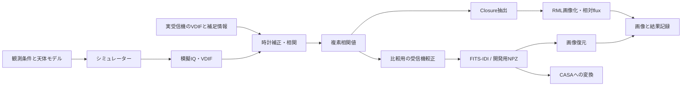

# V-SoRAの使い方と考え方

このプロジェクトは、離れた複数のアンテナが記録した電波を組み合わせ、超新星残骸Cas Aの画像を作ることを目指しています。観測する周波数は1.42 GHz、アンテナ間の距離は最大約600 mです。受信機にはOCXOで基準周波数を安定させたRTL-SDRを使う予定です。

数式は高校数学と複素数・フーリエ変換の初歩を前提に説明します。まず処理の意味を理解し、次に短い模擬データを動かす順番で読めます。

| 読む順 | 文書 | わかること |
| --- | --- | --- |
| 1 | [原理](01-principles.md) | 電圧から相関値、画像へ進む理由。時計と位相を合わせる必要性 |
| 2 | [最初の実行](02-first-run.md) | Ubuntuで点源の模擬観測と画像化を試す方法 |
| 3 | [結果の読み方](03-results.md) | 画像・誤差・収束が何を意味し、何を証明していないか |
| 4 | [実観測へ進む準備](04-observation.md) | VDIF以外に必要な情報と、実データの処理順 |
| 操作 | [日本語GUI](06-gui.md) | ブラウザから模擬観測・検証・結果の保存 |
| 現状 | [実観測に向けた到達点と残る確認](09-observation-readiness.md) | 仮定した計算、有限模擬データ、実機未検証の区別 |
| 随時 | [用語集](glossary.md) | IQ、visibility、SEFD、較正、CLEANなどの意味 |

## 現在できること

天体の模擬画像から相関値を作る処理、模擬IQをVDIFで保存する処理、相関・較正・FITS-IDI出力・画像復元までの小規模CPU実装があります。CASAという既製の画像処理ソフトにも、値と重みを保持して渡せます。模擬的な時計ずれ、受信機の位相・周波数差、電波妨害を個別に検証しました。

**実際のRTL-SDRでCas Aを観測し、画像を復元する試験はまだ行っていません。** 感度や時計精度は仮定しているため、模擬データで画像が出たことと実観測の成功を分けて読みます。

## ソフトの役割

Windows収録ソフトはハードウェアの進捗に合わせて後で開発します。WSL上のCPU処理を日本語ブラウザGUIとCLIから操作でき、模擬観測、VDIFの短区間解析、有限window列、短露光合成、感度・配置比較、保存統計の診断を用意しています。低SNRの実観測画像化と観測全体の運用・速度は未検証です。

開発の流れは[時系列全体レポート](../reports/overviews/development-history.md)、必要な要素と進捗は[目標別全体レポート](../reports/overviews/goal-and-progress.md)で詳しく説明します。

実装の正確な入出力は[ソフト間の規約](../../interfaces/README.md)、各時点の作業と検証は[段階レポート](../reports/README.md)にあります。過去の結果は当時の条件・実装での記録です。

[短積分とClosure＋RML](07-closure-rml.md)：相対flux、事前条件、位置合わせ、探索の停止を読む。

[感度と短い積分](08-sensitivity.md)：アンテナ面積、雑音温度、Closure情報数、許容rate。
