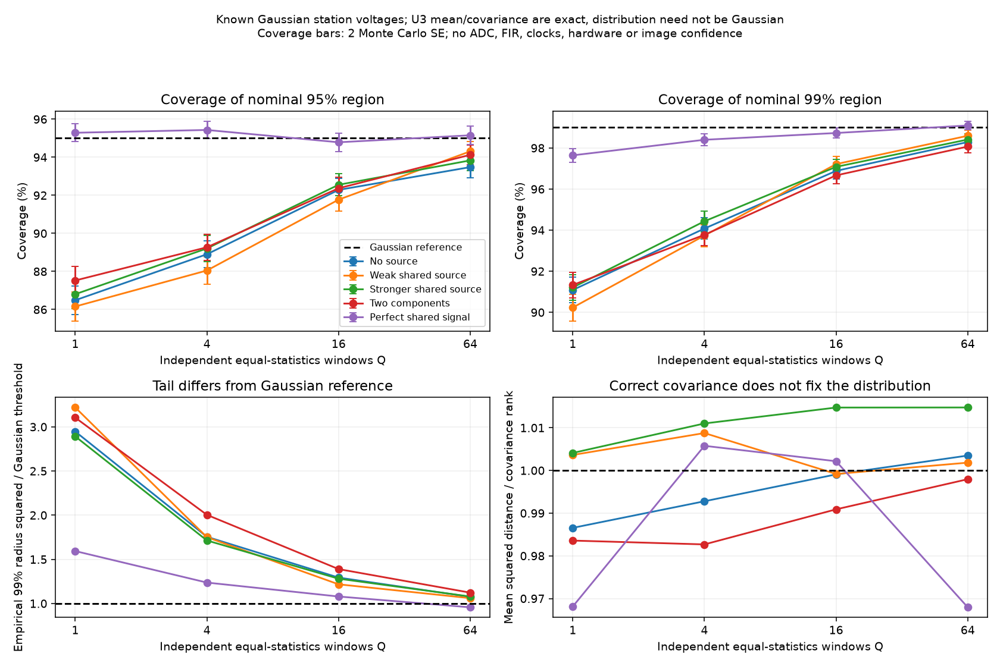

# 段階068：短積分U₃を平均した分布の確認

- 作成日：2026-10-05
- 状態：完了
- 比較元コミット：`99006ef`

## 読者向け概要

平均と分散を正確に計算できても、値の分布がGaussianとは限りません。低SNRで短い積分を重ねたとき、全共分散を使うGaussianの公称95%領域が、実際に約95%の反復結果を含むかを調べます。実機の成功率や画像品質を保証する実験ではありません。

## 1. 目的・対象範囲

段階059と同じ既知・平均0・proper Gaussian局電圧S、各短積分内M個独立・各短積分間も独立・同じ平均bispectrum・gain一定の条件です。Q個のU₃の等重み平均の共分散は、単一U₃の共分散の1/Qとなります。M×Q標本で一つのU₃を作る方法と区別します。

天体なし、弱い共有点源、より強い点源、位相の異なる二成分、完全共有の特異極限の5モデルで、Q=1/4/16/64を比較します。共分散の固有空間で距離を計算し、理論共分散、平均、実測包含率と上側tail、非Gaussian性を比較します。Gaussian包含率が95%になることは完了条件にせず、差がある場合も結果として記録します。

## 2. 完了条件

共分散1/Qを独立反復で確認し、M×Qによる一括U₃との違いをテストする。特異極限の残差が既知の共分散の支持空間内かを確認する。有限値、厳密な整数入力、モデル制約、反復標準誤差を検査し、試行・seed・固定判定条件を記録する。実機・RMLへの適用は行わない。

## 3. 実際の作業

1. `gaussian_averaged_bispectrum_moments` を追加した。既知の局電圧共分散Sから段階059の平均・全共分散を求め、独立したQ個の短積分の平均に変換する。通常の共分散と擬共分散の両方を1/Qにする。
2. 5モデルそれぞれ8,192回の独立反復を行った。各反復の中でQ=1、4、16、64を共通の窓列から作るため、Q同士の比較は対応のある比較となる。
3. 理論共分散で残差を白色化し、Gaussianを仮定した95%・99%領域への実測包含率を計算した。比較用に、同じ次元の標準正規乱数にも同じ手順を適用した。
4. 全共分散・平均の反復標準誤差による固定判定、特異共分散の支持空間、整数入力、M×Qによる一括推定との違いをテストした。
5. インストール後のAPIを作業ツリー外から確認する専用スクリプトを追加した。

主な変更ファイル：

- `apps/simulator/src/vsora_simulator/bispectrum_average.py`：条件付き理論計算。
- `workflows/bispectrum_average_validation.py`：反復実験、固定判定、図の出力。
- `apps/simulator/tests/test_bispectrum_average*.py`：APIと実験の境界条件。
- `tools/verify_bispectrum_average_installed.py`：配布パッケージの確認。
- [平均化のインターフェース](../../interfaces/bispectrum-window-averaging.md)、[Closureの解説](../guide/07-closure-rml.md)：式と適用条件の説明。

Sは実験者が与えた真値であり、観測されたpowerやvisibilityから推定していない。平均も真値を使用し、実験結果に合わせて中心や共分散を調整していない。

## 4. 検証結果

### 4.1 既知モデルの反復実験

最終実行は54.80秒、最大RSSは239,272 KiBだった。図を追加する前の実行は56.09秒、239,316 KiBであり、20条件の数値結果は完全に一致した。seedと判定基準は変更していない。

| モデル | 短積分内の独立標本M | Q=1の実測95% / 99%包含率 | Q=64の実測95% / 99%包含率 |
|---|---:|---:|---:|
| 天体なし、局雑音のみ | 128 | 86.49% / 91.09% | 93.48% / 98.29% |
| とても弱い共有点源 | 128 | 86.16% / 90.23% | 94.31% / 98.60% |
| より強い共有点源 | 128 | 86.80% / 91.21% | 93.84% / 98.41% |
| 位相の異なる二成分 | 32 | 87.52% / 91.33% | 94.13% / 98.07% |
| 完全共有電圧の特異極限 | 32 | 95.29% / 97.64% | 95.15% / 99.10% |

「95%領域」とは**Gaussianなら95%を含むはずの領域**を指す。実測包含率との差はソフトの失敗ではなく、非Gaussianな誤差分布の結果である。最後のモデルは各局が全く同じ電圧を受ける人工的な極限で、独立した受信機雑音を持たない。

20条件すべてで、平均・全共分散・支持空間の確認と、比較用Gaussian乱数の包含率確認が固定基準を満たした。各成分の6標準誤差という基準は今回の再現可能な確認手順であり、全成分の同時信頼領域を保証する値ではない。一方、U₃の実測包含率はQ=64でもモデルによって公称値と異なる。したがって「64回平均すればGaussian尤度を使える」とは結論しない。



図の誤差棒は実測包含率の反復標準誤差の2倍である。右下の距離平均が約1になることは共分散の整合性を示すが、Gaussian性を示さない。左下の99%分位点では分布の裾も比較している。

再実行例：

```bash
OPENBLAS_NUM_THREADS=1 OMP_NUM_THREADS=1 \
  .verification-venv/bin/python tools/run.py workflows.bispectrum_average_validation \
  --output outputs/stage068-reproduction
```

詳細なモデル・seed・20条件の数値は[実行記録](../../validation/runs/stage068/known-window-averaging.json)に保存した。各モデル8,192反復、Q=1/4/16/64、モデルseedは68〜72である。作業用ログと大きな中間データはGit管理外の `outputs/` に置いた。

### 4.2 ソフトウェア検証

環境はPython 3.12.3、NumPy 2.5.1、SciPy 1.18.0、pytest 8.4.2。BLASとOpenMPは各1スレッドとした。

| 確認 | 実測結果 |
|---|---|
| 対象テスト | 38件合格、0.35秒 |
| ソースの全回帰試験 | 799件合格、25,596警告、461.81秒 |
| インストール後の全回帰試験 | 799件合格、25,596警告、462.80秒 |
| 配布APIを作業ツリー外から確認 | 真値20条件の平均・全共分散が保存記録と完全一致。8局112次元の有限値・半正定値も確認 |
| 依存関係 | pip check成功 |

警告は既存依存ソフトを含む非推奨API等の警告で、試験を除外していない。wheelは5,503,372 bytes、SHA-256は `b56c5d07c326b7ff8f98b183b3438c55bfdf729fe6b5416fed3aaa5307d838a3`。全パッケージ対象ファイルをソースとバイト比較した。

[検証記録](../../validation/runs/stage068/verification.json)、[導入済みAPIの確認](../../validation/runs/stage068/installed-api.json)を参照。全ログはGit管理外の `outputs/stage068-source-final/` と `outputs/stage068-installed-final/` に残した。

### 4.3 解釈

**分散が減ることと、正規分布で誤差を表せることは別の条件である。** 電圧がGaussianでも、その三次統計U₃はGaussianとは限らない。弱い信号で画像の尤度を設計する際は、平均と全共分散だけで十分かを別途確認する必要がある。

理論共分散の非零固有空間で使用するGaussian参照距離は、[SciPyのχ²分布](https://docs.scipy.org/doc/scipy/reference/generated/scipy.stats.chi2.html)で計算した。[Blackburn et al. (2020)](https://arxiv.org/abs/1910.02062)の低SNRでのClosure統計の注意点も参照したが、同論文が今回のU₃の尤度を与えると解釈していない。

## 5. 制約

空の変化、投影基線の変化、局gain振幅の変化、時間相関、観測値選別、同じデータでの時計補正、未知power正規化は含まない。同じ平均U₃の仮定が崩れる観測では等重み平均の式を直接適用しない。角度/振幅/比の不偏性も保証しない。

## 6. 次段階

この実験を日本語GUIの動作検証から実行し、公称値と実測値の違いを確認できるようにする。その後、未知の局gainが三次統計の振幅に残す制約と、FFT・補間による時間相関を個別に検討する。今回の平均化APIを実観測のRMLに接続する段階には進めない。
