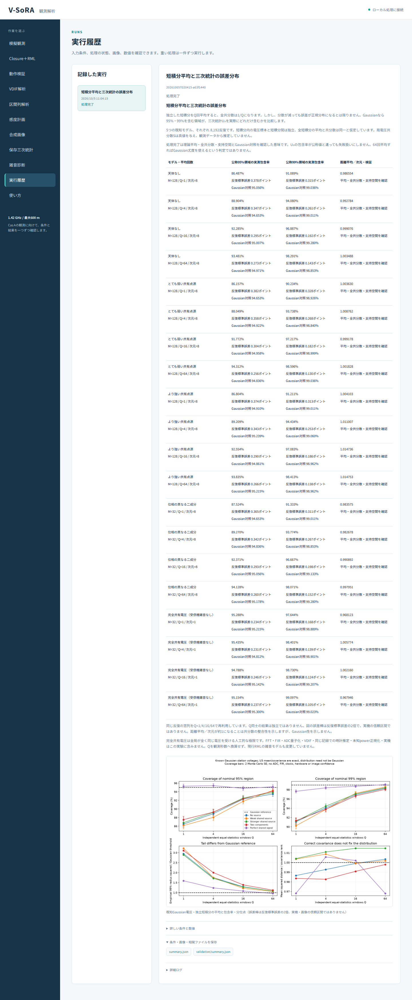

# 段階069：短積分平均の誤差分布を日本語GUIで確認

- 作成日：2026-10-05
- 状態：完了
- 比較元コミット：02f7fb6

## 読者向け概要

平均化で分散が小さくなっても、画像復元に使うGaussian近似が正確になるとは限りません。段階068の反復実験をブラウザから実行し、公称95%・99%領域の実測包含率を読み取れるようにします。

## 1. 目的・対象範囲

既知の5モデル、Q=1/4/16/64、モデルごと8,192反復を既存の動作検証画面に接続する。全20条件の数値・モデル条件・図・JSONを確認する。

## 2. 完了条件

実際のworkerが反復実験を実行して結果と図を保存する。実Chromiumで日本語表示、20条件の全表示数値、JSONの一致、390px画面、外部通信とJS例外を確認する。ソースと配布パッケージの全回帰試験を行う。実測包含率が公称値と違うことを処理失敗と表示しない。

## 3. 実際に行った作業

動作検証に「短積分平均と三次統計の誤差分布」を追加した。既存のジョブ管理と履歴から段階068のworkflowを起動し、5モデル×4平均回数の表、図、詳細JSONを保存する。

結果画面には、M・Q・共分散の支持空間の次元、公称95%・99%領域の実測包含率、反復標準誤差、Gaussian対照の包含率、距離平均／次元を表示した。平均と全共分散の確認と、Gaussian近似の妥当性の確認を混同しない説明を付けた。完全共有電圧の特殊極限、Q間の対応、観測秒数へ換算しない条件も表示した。

変更ファイル：

- `apps/ui/src/vsora_ui/models.py`、`jobs.py`、`worker.py`：検証の選択肢と実行経路。
- `apps/ui/src/vsora_ui/static/index.html`、`app.js`：選択肢、20条件の結果表、日本語の図説明。
- `apps/ui/tests/test_server.py`：実workerで反復実験を実行する試験、選択肢と入力制約。
- `tools/verify_bispectrum_average_ui.py`：ソース／導入済みGUIを実Chromiumで確認するスクリプト。
- [GUIの手引き](../guide/06-gui.md)：操作と数値の読み方。

## 4. 検証条件・結果

対象2試験は50.93秒で合格した。実際のworkerが既定の8,192反復を行い、20条件の全平均・全共分散・支持空間の確認と図・JSONの保存が完了した。Gaussian参照包含率と異なる条件があっても、ジョブは正常に完了した。対象選択による41件の除外は、この対象試験だけの件数であり、全回帰試験では除外しない。

ソースと導入済みGUIの両方を実Chromiumで確認した。各GUIが実際のworkflowを起動した20条件の科学計算結果は、段階068の保存結果と完全一致した。全20行のM・Q・次元、95%・99%の包含率・反復標準誤差・Gaussian対照、距離平均を一行ずつ照合した。ダウンロードした詳細JSONもAPIのsummaryと一致した。

日本語フォント読み込み、390px画面の横はみ出し0、JavaScript例外0、外部リクエスト0を確認した。図の説明は「画像復元の比較」ではなく、独立短積分・包含率・分位点の説明とした。結果画面は全20行を表示するため縦に長い。

環境はPython 3.12.3、NumPy 2.5.1、SciPy 1.18.0、pytest 8.4.2、Chromium 153.0.8010.12。BLAS/OpenMPは各1スレッドとした。

| 確認 | 実測結果 |
|---|---|
| ソース全回帰試験 | 801件合格、25,596警告、512.87秒 |
| 導入済みパッケージの全回帰試験 | 801件合格、25,596警告、514.56秒 |
| ソースの実Chromium | 全20行・JSON・日本語・390px・図説明を確認 |
| 導入済みGUIの実Chromium | 作業ツリー外のGUIで同じ確認を実施 |
| 配布ファイル | 71ファイルをソースとバイト比較し一致 |
| 依存関係 | pip check成功 |

全回帰試験の除外は0件。警告は既存依存ソフトを含む非推奨API等の警告である。wheelは5,504,373 bytes、SHA-256は `2ef0f42c165f511486aa6859cb26253e1502c5f03e5f62d4d29eab8ec6f917a7`。

[検証記録](../../validation/runs/stage069/verification.json)、[ソースGUI](../../validation/runs/stage069/source-browser.json)、[導入済みGUI](../../validation/runs/stage069/browser.json)を保存した。科学計算の詳細は[段階068の20条件](../../validation/runs/stage068/known-window-averaging.json)と完全一致するため、その記録を参照する。



[入力画面](../../validation/runs/stage069/input.png)、[390px画面](../../validation/runs/stage069/mobile.png)も保存した。スクリーンショットのメタデータに個人情報は無いことを確認した。全実行ログはGit管理外の `outputs/stage069-source-final/`、`outputs/stage069-installed-final/`、各browserフォルダに残した。

再実行例：

```bash
PLAYWRIGHT_BROWSERS_PATH=/tmp/vsora-browser \
OPENBLAS_NUM_THREADS=1 OMP_NUM_THREADS=1 \
  .verification-venv/bin/python tools/verify_bispectrum_average_ui.py \
  --output outputs/stage069-reproduction --port 8783
```

これは導入済みGUI用のコマンドである。ソースGUIを確認するときは `tools/run.py tools.verify_bispectrum_average_ui --source-checkout` を使用する。ブラウザ実行環境を別途用意する必要がある。

## 5. 制約・未解決事項

既知の独立Gaussian電圧、同じ平均と共分散の窓を仮定したモデル検証である。実機・観測秒数・画像尤度の保証には使わない。ブラウザ確認はWSLのheadless Chromiumで行い、実Windowsブラウザ・WSLgでの操作は未確認である。GUI本体はwheelから使えるが、動作検証のworkflowはプロジェクトのcheckoutを必要とする。

## 6. 次段階

局gainの振幅が不明なときに残る制約を確認する。
