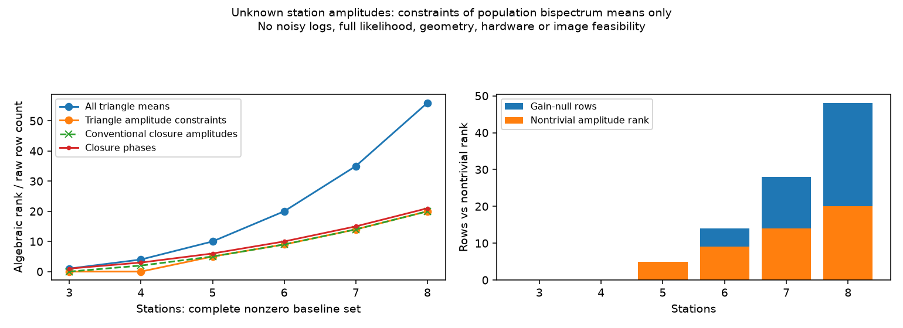

# 段階070：未知の局gainとbispectrum平均の振幅制約

- 作成日：2026-10-05
- 状態：完了
- 比較元コミット：c068c29

## 読者向け概要

局gainは、アンテナや受信機ごとの増幅と位相のずれをまとめた複素係数です。Closure phaseは局ごとの位相誤差を消します。一方、三角形の積の振幅には三局のgain振幅が残ります。局gainを自由に未知としたとき、雑音のない真のbispectrum平均の振幅から、画像形状に関する独立な代数制約をいくつ取り出せるかを確認します。「代数的に独立」は「雑音が統計的に独立」とは異なります。

## 1. 目的・対象範囲

3〜8局、全基線が揃い真のvisibilityが0でない一つの時刻・周波数を対象にする。三角形の振幅和の行列A、基線の局gain和の行列E、三角形へのgain作用G=AEを作る。左からGを消す重みWを求め、rank(WA)を従来のClosure amplitudeと比較する。

有限標本のU₃にlogを適用しない。雑音分布・局powerによる正規化・RMLの尤度・実機の最低局数の設計は行わない。

## 2. 完了条件

3〜8局の整数行列rankを、浮動小数点SVDと独立な有理数消去で照合する。gain不変性、既存Closure amplitudeとの行空間の一致、8局の冗長な恒等式を検査する。4局の同じ平均bispectrum・異なるClosure amplitudeの正定値反例を記録し、局power・有限標本共分散が異なる条件を明記する。導入済みAPIと全回帰試験を実施する。

## 3. 実際に行った作業

`bispectrum_gain_design` を追加した。完全基線の三角形振幅行列A、基線の局gain行列E、G=AE、gainを消す重みWを作り、rank(WA)を返す。既存のClosure phaseとClosure amplitudeの行列と比較する。

整数行列のrankを、浮動小数点SVDとは独立な有理数の行消去で確認した。5〜8局ではW Aと従来のClosure amplitudeの行空間が一致することも検査した。公開結果にはrankと仮定を保存し、SVDの任意の基底を実機の推奨重みとして配布しない。

4局の正定値局共分散を二つ作り、自由な局gain振幅で母bispectrum平均を一致させた。真値の三角形積と段階059の既知Gaussian電圧の平均が一致することを二通りで確認した。

変更ファイル：

- `apps/imaging/src/vsora_imaging/bispectrum_gain.py`：完全基線集合の制約行列。
- `apps/imaging/tests/test_bispectrum_gain.py`、`test_bispectrum_gain_validation.py`：rank、gain不変性、行空間、反例、入力、出力の試験。
- `workflows/bispectrum_gain_validation.py`：6局数の結果と正定値反例、図の出力。
- `tools/verify_bispectrum_gain_installed.py`：作業ツリー外から配布APIを確認。
- [平均制約の規約](../../interfaces/bispectrum-gain-constraints.md)：式、制約、適用範囲。

草稿の初回workflow実行でリストへの`abs`適用による例外を発見し、明示的にnumpy配列へ変換した。修正後は反例のJSON・図を出力できた。本番追加後の対象試験でも出力・読み戻し・再利用拒否を確認した。

## 4. 検証条件・結果

対象24試験が0.42秒で合格した。既知モデルのworkflowは6条件を完了した。

| 局数 | 全三角形数 | gain不変な母bispectrum振幅制約 | 従来のClosure amplitude | Closure phase |
|---:|---:|---:|---:|---:|
| 3 | 1 | 0 | 0 | 1 |
| 4 | 4 | 0 | 2 | 3 |
| 5 | 10 | 5 | 5 | 6 |
| 6 | 20 | 9 | 9 | 10 |
| 7 | 35 | 14 | 14 | 15 |
| 8 | 56 | 20 | 20 | 21 |

8局ではgainを消す重みの空間は48次元だが、28方向は母平均上の恒等式であり、非自明な振幅制約は20次元である。恒等式は有限標本U₃の実現値に必ず成立するわけではない。今回のrankを雑音共分散のrankや独立な測定数として使わない。

4局の反例は、局共分散の対角10・非対角1から、一つの基線の母平均を2に変えたモデルに自由なgainを掛けて作った。四つのbispectrum母平均は同一だが、二つの従来log closure amplitudeはそれぞれlog(2)=0.693147…だけ異なった。全3共分散行列が正定値であることを確認した。局powerと有限標本U₃の全実共分散は異なることも確認している。



[既知モデルの実行記録](../../validation/runs/stage070/known-population-gain.json)には6局数と、反例の3共分散行列・gain・bispectrum・Closure amplitude・局powerを保存した。

再実行例：

```bash
OPENBLAS_NUM_THREADS=1 OMP_NUM_THREADS=1 \
  .verification-venv/bin/python tools/run.py workflows.bispectrum_gain_validation \
  --output outputs/stage070-reproduction
```

環境はPython 3.12.3、NumPy 2.5.1、SciPy 1.18.0、pytest 8.4.2。BLASとOpenMPは各1スレッドとした。

| 確認 | 実測結果 |
|---|---|
| 対象試験 | 24件合格、0.42秒 |
| ソース全回帰試験 | 825件合格、25,596警告、511.63秒 |
| 導入済みパッケージの全回帰試験 | 825件合格、25,596警告、509.40秒 |
| 配布APIを作業ツリー外で確認 | 全6局数のrankが保存結果と一致。4局の母平均一致・有限標本共分散の差も確認 |
| 配布ファイル | 72ファイルをソースとバイト比較し一致 |
| 依存関係 | pip check成功 |

全回帰試験の除外は0件。警告は既存依存ソフトを含む非推奨API等の警告である。wheelは5,505,762 bytes、SHA-256は `67d4ddb11709c6dd68f37ae6b315fba78668f8e4bddf1dad5a42a14693b6280a`。

[検証記録](../../validation/runs/stage070/verification.json)、[導入済みAPI](../../validation/runs/stage070/installed-api.json)を保存した。全実行ログはGit管理外の `outputs/stage070-source-final/` と `outputs/stage070-installed-final/` に残した。図のメタデータはMatplotlibの版とDPIのみで、個人情報は含まれない。

従来のClosure自由度と冗長性は[Blackburn et al. (2020), Section III.2](https://arxiv.org/html/1910.02062v2)を参照した。今回の三角形振幅写像と4局の比較は、本プロジェクトで導出して数値検査した結果である。

## 5. 制約・未解決事項

対象は母集団の平均の代数制約である。有限標本の分布や、保存した局power・追加和が持つ情報を含む全データの識別可能性は評価しない。実際の天体像には基線幾何と空間周波数間の関係もあるため、今回のrankだけで4局の画像化が不可能、5局以上なら成功とは判断しない。

## 6. 次段階

この制約比較を日本語GUIに接続する。天体信号があり時間相関もあるGaussian電圧モデルのU₃の平均を別途確認する。
