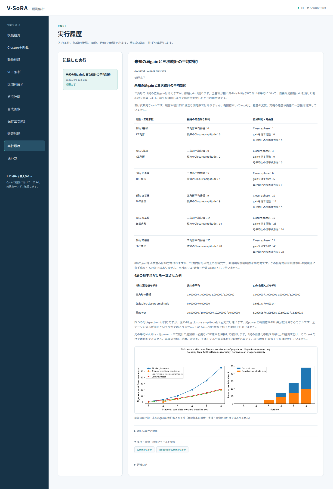

# 段階071：未知gainと母平均の制約を日本語GUIで確認

- 作成日：2026-10-05
- 状態：完了
- 比較元コミット：4b702b9

## 読者向け概要

三角形の数と、局gainを消した非自明な制約数は同じではありません。段階070の結果を動作検証画面から実行し、局数による違いと4局の限定された反例を読み取れるようにします。

## 1. 目的・対象範囲

3〜8局の完全基線集合、非零の母平均visibilityに対する代数制約をGUIに接続する。雑音分布や実機の最低局数は計算しない。

## 2. 完了条件

実workerが結果・図・JSONを保存する。ソースと導入済みGUIの実Chromiumで全6行と反例の数値、JSON、日本語、390px画面、図説明、JS例外と外部通信を確認する。全回帰試験と配布一致も確認する。

## 3. 実際に行った作業

動作検証に「未知の局gainと三次統計の平均制約」を追加した。既存のworkerと履歴から段階070のworkflowを実行する。

結果画面に、局数・基線数・三角形数、母bispectrum振幅と従来のClosure amplitudeのgain不変制約、Closure phase、gainを消す重みの行数と母平均上の恒等式の方向数を表示した。4局の限定された反例では、三角形の振幅・従来のlog closure amplitude・局powerを並べて表示する。

母平均の制約と有限標本の誤差分布、恒等式と雑音共分散のrankを区別する説明を追加した。局powerとU₃共分散が異なるため、全分布の識別不能の反例ではないことも表示する。

変更ファイル：

- `apps/ui/src/vsora_ui/models.py`、`jobs.py`、`worker.py`：選択肢・ジョブ名・実行経路。
- `apps/ui/src/vsora_ui/static/index.html`、`app.js`：結果表・反例・図説明。
- `apps/ui/tests/test_server.py`：実workerと選択肢の試験。
- `tools/verify_bispectrum_gain_ui.py`：ソース／導入済みGUIの実Chromium確認。
- [GUIの手引き](../guide/06-gui.md)：操作と条件。

## 4. 検証条件・結果

対象2試験は0.73秒で合格した。実workerが6局数と反例のJSON・図を出力できた。43件の除外は対象試験だけの選択によるもので、全回帰試験では除外しない。

ソースの実Chromiumで、6行の全制約数・反例の全表示値・保存JSON・図説明・日本語フォント・390px画面を確認した。GUIが実行した科学計算は、段階070の保存結果と完全一致した。JavaScript例外0、外部リクエスト0、横はみ出し0だった。

導入済みGUIの実Chromiumでも全表示値・JSON・日本語・390px・図説明を確認し、科学計算は段階070の保存結果と完全一致した。

環境はPython 3.12.3、NumPy 2.5.1、SciPy 1.18.0、pytest 8.4.2、Chromium 153.0.8010.12。BLAS/OpenMPは各1スレッドとした。

| 確認 | 実測結果 |
|---|---|
| ソース全回帰試験 | 827件合格、25,596警告、512.41秒 |
| 導入済みパッケージの全回帰試験 | 827件合格、25,596警告、509.57秒 |
| ソース・導入済みGUIの実Chromium | 各6局数と4局の例の全表示値・JSON・日本語・390px・図説明を確認 |
| 配布ファイル | 72ファイルをソースとバイト比較し一致 |
| 依存関係 | pip check成功 |

全回帰試験の除外は0件。警告は既存依存ソフトを含む非推奨API等の警告である。wheelは5,506,891 bytes、SHA-256は `6cc471e176f815056a7c9b5302002dbdcd15867ce4609f56e57e885e054038bb`。

[検証記録](../../validation/runs/stage071/verification.json)、[ソースGUI](../../validation/runs/stage071/source-browser.json)、[導入済みGUI](../../validation/runs/stage071/browser.json)を保存した。科学計算の詳細は[段階070の記録](../../validation/runs/stage070/known-population-gain.json)と完全一致する。



[入力画面](../../validation/runs/stage071/input.png)、[390px画面](../../validation/runs/stage071/mobile.png)も保存し、メタデータが空であることを確認した。全実行ログはGit管理外の `outputs/stage071-source-final/`、`outputs/stage071-installed-final/`、各browserフォルダに残した。

再実行例：

```bash
PLAYWRIGHT_BROWSERS_PATH=/tmp/vsora-browser \
OPENBLAS_NUM_THREADS=1 OMP_NUM_THREADS=1 \
  .verification-venv/bin/python tools/verify_bispectrum_gain_ui.py \
  --output outputs/stage071-reproduction --port 8784
```

これは導入済みGUI用である。ソースGUIは `tools/run.py tools.verify_bispectrum_gain_ui --source-checkout` を使用する。ブラウザ実行環境を別途用意する必要がある。

## 5. 制約・未解決事項

母平均の代数制約であり、有限標本U₃の恒等式、雑音共分散のrank、全分布の識別可能性、画像化の可否は保証しない。ブラウザ確認はWSLのheadless Chromiumを使用し、実Windowsブラウザ・WSLgの操作は未確認である。導入済みGUIの動作検証workflowはプロジェクトのcheckoutを必要とする。

## 6. 次段階

天体信号があり時間相関もあるGaussianモデルの三次統計の平均を確認する。
