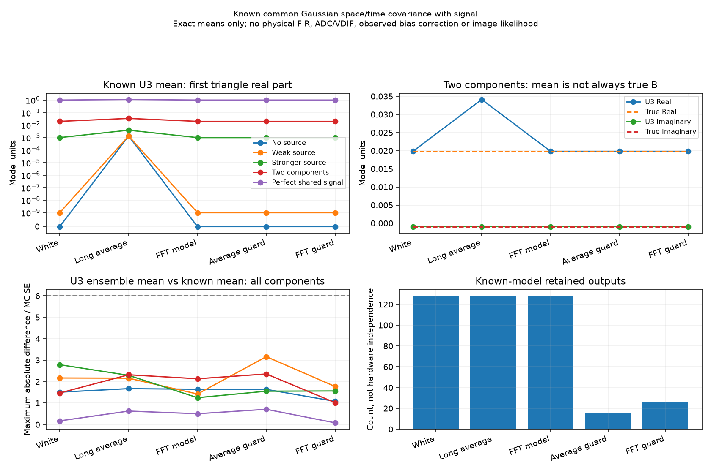

# 段階072：天体信号と共通時間相関が三次統計の平均へ与える影響

- 作成日：2026-10-05
- 状態：完了
- 比較元コミット：9fb0ec1

## 読者向け概要

U₃は、電圧標本が独立なときに真のbispectrumの平均へ一致する統計です。フィルタや補間で隣の標本と相関すると、この条件が崩れます。天体信号があるときの追加項を既知モデルで計算し、反復実験の平均がその式に一致するかを確かめます。

## 1. 目的・対象範囲

平均0のproper Gaussian電圧を仮定する。properとは、複素電圧同士の共分散E[x x]が0となる条件で、実部と虚部が円対称なモデルに対応する。局と時間の共分散がS_i,j K_t,uと分離でき、全局共通のK・一定で正の時間powerを持つ条件に限る。

5局共分散モデルと5時間相関モデルの25条件、各8,192反復、seed72〜96を固定して比較する。既知共分散からGaussian係数を直接生成する。ADC・FIR・VDIFの物理処理や、局別の異なる時計・補間、未知の偏り補正、分散・尤度の計算は行わない。

## 2. 完了条件

全6通りのGaussian縮約・全時刻列の総当たりと平均式を比較する。独立時刻・完全共有時刻・受信機雑音だけ・固定gainの極限と、有限値・入力範囲を確認する。25条件の全三角形、通常の積とU₃の実部・虚部の平均を固定6反復標準誤差と丸め許容値で確認する。失敗時もJSONと図を残す。導入済みAPIと全回帰試験を確認する。

## 3. 実際に行った作業

既知の局共分散Sと共通時間共分散Kに対し、通常の三基線平均の積と異標本U₃の期待値を計算するAPIを追加した。Kの対角を0にした行列を使い、時間相関が0になる極限でtrace同士の大きな引き算を避ける。

三角形の真値Bに加え、天体信号を含む二時刻の項Dと、受信機雑音を含む三時刻cycleの項P+conjugate(B)を計算する。各項と仮定を分けて返し、観測値からの偏り補正として使用しない。

全6通りのGaussian縮約と全時刻列による小さいMの総当たりを、閉じた平均式と照合した。独立時刻、完全に同じ電圧を繰り返す時刻、天体無し、固定局gain、数値範囲の試験も追加した。

変更ファイル：

- `apps/simulator/src/vsora_simulator/bispectrum_common_temporal.py`：既知の共通時間相関に対する平均式。
- `apps/simulator/tests/test_bispectrum_common_temporal.py`、`test_bispectrum_signal_temporal_validation.py`：総当たり・極限・固定実験・失敗記録。
- `workflows/bispectrum_signal_temporal_validation.py`：25条件の反復実験と図。
- `tools/verify_bispectrum_common_temporal_installed.py`：作業ツリー外から配布APIの理論値を照合。
- [共通時間相関の規約](../../interfaces/bispectrum-common-temporal.md)：式と生成条件。

草稿の初回起動は、起動用スクリプトからcheckoutのworkflowを読み込めず停止した。経路を明示して起動し、本番では既存の `tools/run.py` を使った。seed・生成条件・判定条件は変更していない。

## 4. 検証条件・結果

### 4.1 対象試験と25条件

本番sourceの対象45試験が0.52秒で合格した。既知5信号×5時間モデルの25条件を各8,192反復し、通常の積とU₃の全4三角形・実部／虚部の平均が固定判定基準に整合した。本番source実行は4.45秒、最大RSS150,428 KiB。草稿の予備実行は4.45秒、150,548 KiBで、25条件の全数値は完全に一致した。

信号モデルは段階059のSを使用する。天体無しはI、とても弱い点源はI+0.001J、より強い点源はI+0.1J、二成分はI+0.2J+0.15vv*、完全共有電圧はJ。Iは4局単位行列、Jは全成分1、vの位相は0/0.7/1.9/−0.5 radである。標本数Mは時間モデルで決まり、段階059で使用したMをそのまま流用していない。

時間モデルは128出力の独立時刻、65 tap box・raw hop8、固定FFT32・channel16・補間位相0.25、および既知係数の支持範囲が分離する間引きの2条件。出力powerを1に規格化する。boxを9出力おきに保持すると15、FFTモデルを5出力おきに保持すると26になる。

以下は最初の三角形の**理論値**である。電圧は任意のモデル単位であり、Jyや実機のADC校正値ではない。

| 信号モデル | 真の周辺bispectrum B | 長いboxモデルのE[U₃] |
|---|---|---|
| 天体なし | 0 | 0.00134497 |
| とても弱い点源 | 1×10⁻⁹ | 0.00134912 |
| より強い点源 | 0.001 | 0.00392770 |
| 位相の異なる二成分 | 0.0198161 − 0.000944935i | 0.0341090 − 0.000943664i |
| 完全共有電圧 | 1 | 1.10598 |

独立時刻とモデル上で支持範囲が分離する間引きでは、追加項が0になる。固定FFTモデルでは追加項は小さいが0ではなく、今回の有限反復では真値との差を分離できなかった。差が分離できないことを、実FFTの不偏性・独立性の証明として扱わない。

完全共有電圧は全局が全く同じ電圧を受ける人工的な極限で、独立した受信機雑音を持たない。既知モデルの6反復標準誤差という固定判定は、全成分の同時信頼区間や実機の信頼区間を保証しない。



図の左上と右上は理論平均、左下はU₃の全成分で最大となる反復平均と理論値の差を反復標準誤差で割った値、右下は既知モデルの保持数である。平均の角度は、一度測った角度の期待値と異なるため、Closure phaseの不偏性の確認として使用しない。

[25条件の実行記録](../../validation/runs/stage072/known-signal-temporal.json)に、全三角形の理論平均・反復平均・反復標準誤差・二つの追加項・seed72〜96を保存した。反復標準誤差は独立した模擬反復のばらつきから計算した値で、観測U₃の雑音モデルではない。APIは分散・尤度を理論計算していない。

再実行例：

```bash
OPENBLAS_NUM_THREADS=1 OMP_NUM_THREADS=1 \
  .verification-venv/bin/python tools/run.py workflows.bispectrum_signal_temporal_validation \
  --output outputs/stage072-reproduction
```

### 4.2 ソフトウェア検証

ソースの全回帰試験は872件合格、25,596 warnings、510.03秒。wheelを導入した環境でも872件合格、25,596 warnings、506.15秒。試験の除外は0件である。既存の依存ライブラリに由来する警告は成功件数に含めず、ログに残した。

配布APIを作業ツリー外から読み込み、25条件の通常の積とU₃の理論平均が保存記録と配列単位で完全に一致することを確認した。8局・56三角形でも有限値を確認した。これは実機データの照合ではない。

Python 3.12.3、NumPy 2.5.1、SciPy 1.18.0、pytest 8.4.2を使用し、BLASとOMPは各1スレッドとした。`pip check`は成功した。wheelは5,508,695 bytes、SHA-256は `6382b7240a269090851b0a92556f06cb2b5d119273026ebcad296be0a017a644`。収録された73ファイルの内容がソースと完全に一致した。

[ソフトウェア検証記録](../../validation/runs/stage072/verification.json)と[導入済みAPIの照合](../../validation/runs/stage072/installed-api.json)を保存した。詳細ログとwheelはGit管理外の `outputs/stage072-source-final/`、`outputs/stage072-installed-final/`、`outputs/stage072-wheel-final/` に置いた。

## 5. 制約・未解決事項

既知の平均の式であり、観測U₃の偏り補正ではない。局ごとの異なるK、時間変化する局gain、同じデータでのLO推定、品質選別、ADC量子化、未知power正規化、GaussianなU₃尤度、画像品質を保証しない。独立窓を平均しても各窓に残る平均の偏りは消えない。実際のガード間隔や有効独立数の推奨値に使わない。

## 6. 次段階

この平均の比較を日本語GUIで実行できるようにする。実FFTの局ごとに異なる処理と、未知gain・低SNRの画像尤度は別途検討する。
