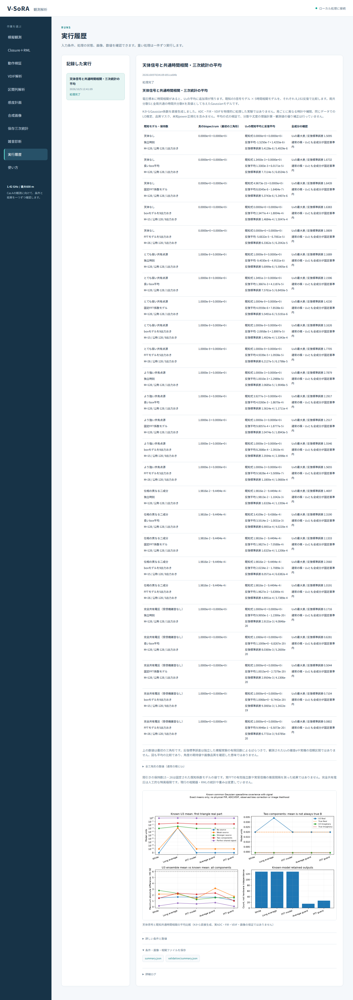

# 段階073：天体信号と共通時間相関の平均比較を日本語GUIで確認

- 作成日：2026-10-05
- 状態：完了
- 比較元コミット：d5a319a

## 読者向け概要

独立標本という仮定が崩れると、U₃にも平均の追加項が残ります。段階072の既知モデルをブラウザから実行し、理論平均と反復平均・有限反復の標準誤差を読み取れるようにします。

## 1. 目的・対象範囲

既知Sと全局共通Kの25条件・各8,192反復を動作検証に接続する。最初の三角形の概要と、全三角形の通常の積・U₃の200行を表示する。観測偏り補正、分散・尤度の理論計算、実機の有効独立数は対象にしない。

## 2. 完了条件

実workerが25条件のJSONと図を保存する。ソース／導入済み実Chromiumで概要25行・詳細200行の数値、保存JSON、図説明、日本語・390px・JS例外と外部通信を確認する。ソースと導入済みパッケージの全回帰試験と配布一致を確認する。

## 3. 実際に行った作業

動作検証の選択肢に「天体信号と共通時間相関・三次統計の平均」を追加した。段階072の固定されたworkflowを既存workerから実行し、履歴と保存ファイルに結果を残す。

概要は25条件の最初の三角形について、真の周辺bispectrum、U₃の既知平均、反復平均、実部・虚部の反復標準誤差を表示する。保持数と公称出力数、間引きの条件も示す。展開できる詳細表は全4三角形×2統計×25条件の200行である。

図の説明は平均比較であることを示し、Kから係数を直接生成した実験と、実ADC・FIR・VDIF処理の区別を明記した。反復標準誤差と実観測の誤差、既知モデルの保持数と実機の独立標本数も区別する。

変更ファイル：

- `apps/ui/src/vsora_ui/models.py`、`jobs.py`、`worker.py`：選択肢・ジョブ名・実行経路。
- `apps/ui/src/vsora_ui/static/index.html`、`app.js`：25条件の概要・200行の詳細・図説明。
- `apps/ui/tests/test_server.py`：実workerと選択肢の試験。
- `tools/verify_signal_temporal_bispectrum_ui.py`：ソース／導入済みGUIの実Chromium確認。
- [GUIの手引き](../guide/06-gui.md)：操作と読み方。

## 4. 検証条件・結果

対象2試験は4.82秒で合格した。45件の除外は対象試験だけの選択によるもので、全回帰試験では除外しない。対象実workerが25条件のJSONと図を保存した。

ソースの実Chromiumで概要25行・詳細200行の全表示値、保存JSON、図の説明、日本語フォントと390px画面を確認した。GUIから実行した全科学計算JSONは、段階072の保存結果と完全一致した。JavaScript例外0、外部リクエスト0、横はみ出し0だった。

導入済みGUIの実Chromiumでも概要25行・詳細200行の全表示値、JSON、図の説明、日本語と390px画面を確認した。全科学計算JSONは段階072と完全一致した。JavaScript例外0、外部リクエスト0、横はみ出し0だった。

| 確認 | 実測結果 |
|---|---|
| ソース全回帰試験 | 874件合格、25,596警告、514.59秒 |
| 導入済みパッケージの全回帰試験 | 874件合格、25,596警告、514.97秒 |
| 配布ファイル | 73ファイルをソースとバイト比較し一致 |
| 依存関係 | pip check成功 |

全回帰試験の除外は0件。警告は既存依存ソフトを含む非推奨API等の警告である。Python 3.12.3、NumPy 2.5.1、SciPy 1.18.0、pytest 8.4.2、Chromium 153.0.8010.12を使用し、BLAS/OpenMPは各1スレッドとした。

wheelは5,509,776 bytes、SHA-256は `02c2fedef5445beb6d1c30a6fc092d32ed284648cd28deec149af3aa71c36a70`。[検証記録](../../validation/runs/stage073/verification.json)、[ソースGUI](../../validation/runs/stage073/source-browser.json)、[導入済みGUI](../../validation/runs/stage073/browser.json)を保存した。科学計算の詳細は[段階072の25条件](../../validation/runs/stage072/known-signal-temporal.json)と完全一致する。



[入力画面](../../validation/runs/stage073/input.png)、[390px画面](../../validation/runs/stage073/mobile.png)も保存した。スクリーンショットのメタデータは空である。詳細ログとwheelはGit管理外の `outputs/stage073-source-final/`、`outputs/stage073-installed-final/`、各browserフォルダに置いた。

再実行例：

```bash
PLAYWRIGHT_BROWSERS_PATH=/tmp/vsora-browser \
OPENBLAS_NUM_THREADS=1 OMP_NUM_THREADS=1 \
  .verification-venv/bin/python tools/verify_signal_temporal_bispectrum_ui.py \
  --output outputs/stage073-reproduction --port 8785
```

ソースGUIは `tools/run.py tools.verify_signal_temporal_bispectrum_ui --source-checkout` を使用する。ブラウザ実行環境を別途用意する必要がある。

## 5. 制約・未解決事項

Gaussian係数を既知Kから直接生成した実験である。ADC/FIR/VDIFを物理的に処理した実験ではなく、局ごとの異なる時計・補間・品質選別・未知power・同じデータでのLO推定は含まない。反復標準誤差を実観測の誤差σとして使わない。ブラウザ確認はWSLのheadless Chromiumで、実Windowsブラウザ・WSLgの操作は未確認。導入済みGUIの動作検証workflowはプロジェクトのcheckoutを必要とする。

## 6. 次段階

帯域・短積分・局数・アンテナ感度の仮定が三次統計の既知モデルへ与える影響を整理する。
