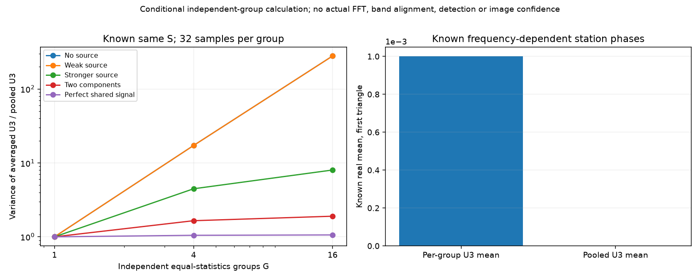

# 段階074：独立周波数群の三次統計とまとめ方の条件

- 作成日：2026-10-05
- 状態：完了
- 比較元コミット：3cc9c07

## 読者向け概要

帯域を広げる方法には、周波数群ごとにU₃を作って平均する方法と、全電圧標本をまとめてU₃を作る方法があります。同じ独立標本数でも分散は同じとは限りません。また、周波数ごとに未知の局位相が異なると、後者の平均は目的のbispectrumから変わる場合があります。

## 1. 目的・対象範囲

既知局共分散Sを持つ独立Gaussian標本を仮定し、5信号モデル×群数1/4/16の15条件で、同じ模擬電圧から二つの統計を比較する。各群32標本、各モデル8,192反復、seed74〜78を事前に固定する。周波数群の独立性・同じSはモデル上の仮定であり、実FFTで確認した値ではない。

局位相が群ごとに異なる既知正定値モデルでは、全群をまとめたU₃の母平均を独立標本の基線平均から計算し、小規模の全順序三つ組と照合する。未知gainやdelayを実データから推定しない。

## 2. 完了条件

母平均式を総当たり・同じSの極限・固定局gain・周波数依存局位相の例で照合する。15条件の全三角形の平均・実共分散を固定6反復標準誤差基準で確認する。位相変化例の既知平均と反復平均も確認する。失敗時にも結果を保存する。導入済みAPI、ソースと導入済みの全回帰試験を確認する。

## 3. 実際に行った作業

独立標本で群ごとに基線平均が異なる場合の、全標本をまとめたU₃の母平均APIを追加した。三基線の和・同じ標本を含む組の和・三辺の同じ標本の和を用い、全て異なる順序三つ組の平均を包含排除で計算する。小規模の全順序三つ組による総当たりと照合した。

全群の局共分散Sが同じ場合は、段階059・068の共分散式を用いて、群ごとのU₃の等平均と、全標本をまとめたU₃を比較する。模擬電圧を共用し、群数1/4/16には同じ試行の先頭群を使うため、各比較は統計的に対になっている。

4群の位相変化例では、固定された局位相が各群のU₃では打ち消されることと、群をまたいだ標本の組み合わせでは母平均が変わることを確認する。異なるSの群をまとめた場合の雑音共分散は計算しない。

変更ファイル：

- `apps/simulator/src/vsora_simulator/bispectrum_pooling.py`：既知の群別共分散による母平均。
- `apps/simulator/tests/test_bispectrum_pooling.py`、`test_bispectrum_pooling_validation.py`：総当たり・極限・条件・失敗記録。
- `workflows/bispectrum_pooling_validation.py`：固定15条件と位相変化の反復実験・図。
- `tools/verify_bispectrum_pooling_installed.py`：作業ツリー外から配布APIを照合。
- [独立群をまとめる規約](../../interfaces/bispectrum-independent-group-pooling.md)：式と適用条件。

## 4. 検証条件・結果

### 4.1 対象試験と固定条件の反復実験

正式なソースの対象35試験は0.22秒で合格した。草稿を別プロセスへ読み込んだ予備試験は35件、0.08秒で合格していた。正式実装の検証とは区別して記録する。

正式実装では、5信号モデル×群数1/4/16の15条件を各モデル8,192反復し、全4三角形の平均と実共分散が固定6反復標準誤差基準に整合した。4群の局位相変化例も8,192反復し、二つの統計の平均が既知式に整合した。seed74〜79、各群32標本は事前に固定した。

正式実行は5.02秒、最大RSS記録495,460 KiB。予備実行は4.71秒、98,120 KiBで、科学計算の全JSONは完全に一致した。RSSは各起動経路の記録であり、入力サイズによるメモリ増加率の測定ではない。

以下は最初の三角形の**理論分散比**である。値は「群別U₃の平均の分散 ÷ 全標本をまとめたU₃の分散」で、検出確率や画像SNRではない。

| 既知信号モデル | 4群 | 16群 |
|---|---:|---:|
| 天体なし | 17.2065 | 280.226 |
| より強い共有点源 | 4.46838 | 8.02016 |
| 位相の異なる二成分 | 1.65259 | 1.90111 |
| 完全共有電圧 | 1.04867 | 1.06108 |

天体なしの比は、群数G・各群M標本に対する `(GM−1)(GM−2)/[(M−1)(M−2)]` の式とも照合した。完全共有電圧は独立した受信機雑音のない人工的な極限である。全ての信号モデルで同じ改善幅となる結果ではない。

局位相変化の例は、4群・4局の `S=I+0.1J` に群別の既知局位相を掛けた正定値モデルである。各群の三角形平均は0.001だが、全標本をまとめたU₃の平均は約1.24984×10⁻⁷になる。群ごとの有限標本U₃は位相変更前後で最大差6.94×10⁻¹⁷だった。異なる群の局位相を混ぜる処理は、各群のClosureを平均する処理と条件が異なる。

### 4.2 ソフトウェア検証

ソースの全回帰試験は909件合格、25,596 warnings、552.58秒。wheelを導入した環境でも909件合格、25,596 warnings、549.06秒。試験の除外は0件である。

配布APIを作業ツリー外から読み込み、4群の局位相変化の母平均、天体なしの群数1/4/16の分散比を別の式で照合した。8局・56三角形の母平均も有限であることを確認した。Python 3.12.3、NumPy 2.5.1、SciPy 1.18.0、pytest 8.4.2を使用し、BLAS/OMPは各1スレッドとした。`pip check`は成功した。

wheelは5,511,264 bytes、SHA-256は `c7899af855f407f15cc68ad36470e0f1337f0d9580f0f4deda69ee16255e1800`。収録された74ファイルをソースとバイト比較し、完全一致した。

[全条件の計算記録](../../validation/runs/stage074/known-independent-groups.json)、[ソフトウェア検証記録](../../validation/runs/stage074/verification.json)、[導入済みAPI照合](../../validation/runs/stage074/installed-api.json)を保存した。



図の左は同じ既知Sの理論分散比、右は群別局位相のある例の理論母平均である。図の量は平均と分散であり、測定位相の期待値や画像品質ではない。公開図のメタデータはMatplotlibの識別文字列とdpiのみである。詳細ログとwheelはGit管理外の `outputs/stage074-source-final/`、`outputs/stage074-installed-final/`、`outputs/stage074-wheel-final/` に置いた。

再実行例：

```bash
OPENBLAS_NUM_THREADS=1 OMP_NUM_THREADS=1 \
  .verification-venv/bin/python tools/run.py workflows.bispectrum_pooling_validation \
  --output outputs/stage074-reproduction
```

## 5. 制約・未解決事項

実周波数群の相互独立性、局の帯域特性・時計・delay・天体構造の周波数変化、量子化、同じデータでの補正推定を含まない。既知平均と共分散はGaussianなU₃分布、検出確率、実観測時間、画像品質を保証しない。実相関器とRMLの処理は変更しない。

## 6. 次段階

比較を日本語GUIに接続し、実際の帯域・局gainの条件を別途検討する。
