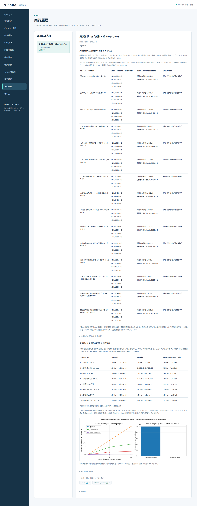

# 段階075：周波数群の三次統計のまとめ方を日本語GUIで確認

- 作成日：2026-10-05
- 状態：完了
- 比較元コミット：4c57f5d

## 読者向け概要

同じ独立標本でも、U₃を作る順序で分散が変わります。また、周波数ごとに局位相が異なると、標本を混ぜた統計の平均も変わる場合があります。段階074の二つの比較をブラウザから実行できるようにします。

## 1. 目的・対象範囲

既知の同じSによる15条件と、4群の局位相変化の例を表示する。概要15行、全三角形の平均・分散120行、位相変化例8行を確認できるようにする。実観測の帯域混合や未知delay推定は対象外である。

## 2. 完了条件

実workerが固定反復実験を実行する。ソース・導入済み実Chromiumで全表示数値・保存JSON・図説明、日本語と390px画面、JS例外・外部通信を確認する。全回帰試験と配布一致も確認する。

## 3. 実際に行った作業

動作検証に「周波数群の三次統計・標本のまとめ方」を追加し、段階074の固定workflowを既存workerから実行する経路を接続した。

概要15行には、信号モデル・群数・各群と全体の標本数、全三角形の理論分散比、最初の三角形の理論複素分散を表示する。展開する詳細120行では、全三角形・二つの方法の既知平均、反復平均、反復標準誤差、理論複素分散を確認できる。

局位相変化の例は別の8行に表示する。同じSの群を使う分散比較と、異なる局位相を持つ母平均の例を区別する。全実共分散はJSONへ保存し、実観測の帯域補正やGaussianなU₃尤度と混同しない説明を追加した。

変更ファイル：

- `apps/ui/src/vsora_ui/models.py`、`jobs.py`、`worker.py`：選択肢と実行経路。
- `apps/ui/src/vsora_ui/static/index.html`、`app.js`：概要・詳細・局位相例・図説明。
- `apps/ui/tests/test_server.py`：実workerと選択肢の試験。
- `tools/verify_bispectrum_pooling_ui.py`：ソース／導入済み実Chromiumによる全数値の確認。
- [GUIの手引き](../guide/06-gui.md)：操作と量の読み方。

## 4. 検証条件・結果

対象2試験は5.15秒で合格した。47件の除外は対象試験だけの選択によるもので、全回帰試験では除外しない。実workerが15条件と局位相変化の例を計算し、JSONと図を保存した。

ソースの実Chromiumで概要15行・詳細120行・局位相例8行の全表示値、保存JSON、図の説明、日本語フォント・390px画面を確認した。科学計算の全JSONは段階074の保存結果と完全一致した。JavaScript例外0、外部リクエスト0、横はみ出し0だった。

導入済みGUIの実Chromiumでも概要15行・詳細120行・局位相例8行の全数値、保存JSON、図説明、日本語フォントと390px画面を確認した。科学計算の全JSONは段階074と完全一致した。JavaScript例外0、外部リクエスト0、横はみ出し0だった。

| 確認 | 実測結果 |
|---|---|
| ソース全回帰試験 | 911件合格、25,596警告、554.99秒 |
| 導入済みパッケージの全回帰試験 | 911件合格、25,596警告、554.56秒 |
| 配布ファイル | 74ファイルをソースとバイト比較し一致 |
| 依存関係 | pip check成功 |

全回帰試験の除外は0件。警告は既存依存ソフトを含む非推奨API等の警告である。Python 3.12.3、NumPy 2.5.1、SciPy 1.18.0、pytest 8.4.2、Chromium 153.0.8010.12を使用し、BLAS/OpenMPは各1スレッドとした。

wheelは5,512,440 bytes、SHA-256は `b425a1592d4e6762cf5e79b9c5d51c6b3f3fa2878aa96391a9759884ea85c589`。[検証記録](../../validation/runs/stage075/verification.json)、[ソースGUI](../../validation/runs/stage075/source-browser.json)、[導入済みGUI](../../validation/runs/stage075/browser.json)を保存した。科学計算の詳細は[段階074の記録](../../validation/runs/stage074/known-independent-groups.json)と完全一致する。



[入力画面](../../validation/runs/stage075/input.png)、[390px画面](../../validation/runs/stage075/mobile.png)も保存した。スクリーンショットのメタデータは空である。詳細ログとwheelはGit管理外の `outputs/stage075-source-final/`、`outputs/stage075-installed-final/`、各browserフォルダに置いた。

再実行例：

```bash
PLAYWRIGHT_BROWSERS_PATH=/tmp/vsora-browser \
OPENBLAS_NUM_THREADS=1 OMP_NUM_THREADS=1 \
  .verification-venv/bin/python tools/verify_bispectrum_pooling_ui.py \
  --output outputs/stage075-reproduction --port 8786
```

ソースGUIは `tools/run.py tools.verify_bispectrum_pooling_ui --source-checkout` を使用する。ブラウザ実行環境を別途用意する必要がある。

## 5. 制約・未解決事項

全群が独立で同じ既知Sという分散比較と、異なる局位相を持つ母平均の例を区別する。異なるSの群をまとめた統計の雑音共分散は計算しない。実FFTの独立性、観測帯域補正、GaussianなU₃尤度、実観測時間・検出確率・画像品質は保証しない。ブラウザ確認はWSLのheadless Chromiumで、実Windowsブラウザ・WSLgの操作は未確認。導入済みGUIの動作検証workflowにはcheckoutが必要である。

## 6. 次段階

短積分・帯域・天体形状の仮定を明示し、観測条件の見通しを既知モデルで検討する。
