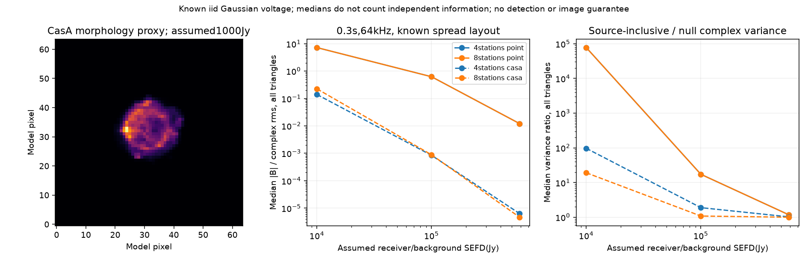

# 段階076：既知Cas A形状と天体雑音を含む三次統計の尺度

- 作成日：2026-10-05
- 状態：完了
- 比較元コミット：08b1e3d

## 読者向け概要

Cas Aは点ではなく広がった天体です。長い基線では総fluxより相関fluxが小さくなります。天体信号は平均だけでなく雑音共分散にも入ります。既知の形状と受信機powerから局共分散を作り、三次統計の平均とばらつきを条件付きで比較します。

## 1. 目的・対象範囲

非負の離散天体画像から局電圧の共分散を作り、既存のdirect visibilityと照合する。受信機・背景SEFDは対象天体のpowerを含まない仮定とし、対象天体のpowerを別に加える。Cas A画像は2017年・1378/1750MHzの形状参照で、総flux1000Jyと1.42GHzの形状は今回の仮定である。

基線長600m以下、4/8局、3配置、点源とCas A形状、3SEFD、0.1/0.3/1/3秒の144条件を単一64kHzの既知モデルで比較する。M=Bτを独立標本数と仮定する。時計・LOは既に補正され、各短積分のgainが一定という条件を置く。

三次統計の尺度は `|母平均| / sqrt(E|U₃−母平均|²)` とする。段階057の一成分σによる尺度と同じ定義ではない。検出確率や位相信頼区間を計算しない。同じS・uvを繰り返す仮定の反復数と秒数は、実観測時間の推奨値ではない。

## 2. 完了条件

局応答のGram行列とdirect visibilityの符号・単位を照合する。PSD、零天体、power、数値範囲、固定gainの尺度不変性を確認する。既知の3共分散で全三角形の平均・全実共分散を固定6反復標準誤差基準で照合する。144条件と代表全共分散・画像参照SHAを記録する。配布APIとソース・導入済みの全回帰試験を確認する。

## 3. 実際に行った作業

非負の天体画素fluxと各局の応答から、局電圧の共分散を作るAPIを追加した。局応答のGram行列へ独立した受信機・背景powerを加え、既知総powerで単位対角へ規格化する。規格化は生成モデルの既知値を使う操作で、観測powerを推定した処理ではない。

段階059の天体を含む有限Mの平均・全共分散を使い、三角形ごとの複素rms尺度と、天体無しの分散に対する比を返すAPIを追加した。同じS・uvを持つ独立窓を繰り返す条件の反復数も保存する。平均が数値0の場合と、反復数が上限10¹⁸を超える場合は別状態にし、nullをゼロ時間として扱わない。

144条件を一つの仮想snapshotで比較し、4局と8局の代表条件の全実共分散、参照画像SHA、局座標、EOP情報を保存するworkflowを追加した。3つの既知Sの反復実験では、共分散を求める積の配列を64反復ずつ処理した。小さい配列の全積による計算と、標準誤差まで一致することを確認した。

変更ファイル：

- `apps/simulator/src/vsora_simulator/sky_covariance.py`：既知天体と受信機powerの局共分散。
- `apps/simulator/src/vsora_simulator/bispectrum_scale.py`：天体を含む複素rms尺度と条件付き反復数。
- `apps/simulator/tests/test_sky_covariance.py`、`test_bispectrum_scale.py`、`test_bispectrum_known_sky_validation.py`：符号・単位・極限・条件・小分け計算・失敗記録。
- `workflows/bispectrum_known_sky_validation.py`：144条件と3既知共分散の反復実験。
- `tools/verify_bispectrum_known_sky_installed.py`：作業ツリー外から配布APIと参照画像を照合。
- [既知天体の規約](../../interfaces/bispectrum-known-sky-scale.md)：Gram行列・尺度・仮定の説明。

最初の草稿試験では37件中2件が失敗した。既存visibilityと方向cosineの式順序が異なる丸め差、および規格化対角と1の機械精度差を検出した。方向cosineの式順序をそろえ、既知単位powerの対角を1と明示して、同じ厳密な試験を再実行した。修正後37件、workflow追加後64件が合格した。対象試験の許容差と、反復実験の固定6標準誤差基準は変更していない。

## 4. 検証条件・結果

### 4.1 対象試験と既知モデル

正式な対象64試験は1.71秒で合格した。全順序の符号・Gram行列・direct visibility、power、PSD、零天体、固定gainでの尺度不変性、範囲外入力、失敗JSONの保存を確認した。

正式な144条件と、M128・各8,192反復・seed76〜78の3共分散で、全三角形の平均と全実共分散が固定6反復標準誤差基準に整合した。4局点源、4局Cas A形状、8局Cas A形状である。正式実行2.61秒、最大RSS199,788 KiB。最終草稿の予備実行2.66秒、199,856 KiBで、全科学計算JSONは完全一致した。

8局の112実成分では、積の中間配列は計算上64×112×112×8 bytes＝約6.13 MiBとなる。8,192反復を一括で作る場合の約784 MiBの配列は作成しない。この配列サイズは計算値、上記RSSは起動プロセスの実測記録である。

### 4.2 今回の仮定での比較

以下はspread配置、64kHz、0.3秒、総flux1000Jyの**理論尺度の全三角形における中央値**である。中央値を独立な情報量や画像SNRと読み替えない。

| 受信機・背景SEFDの仮定 | 点源（4/8局） | Cas A形状・4局 | Cas A形状・8局 |
|---|---:|---:|---:|
| 10,000 Jy | 7.19068 | 0.139434 | 0.224407 |
| 100,000 Jy | 0.621217 | 0.000840533 | 0.000879650 |
| 585,966 Jy | 0.0121279 | 0.00000631934 | 0.00000463885 |

最後のSEFDは、直径1m・効率0.6・受信機と背景の温度100Kという仮定から計算した。実際の自作アンテナ・RTL-SDRの測定値ではない。点源では総fluxが全基線の相関fluxとなるが、拡がったCas A形状では三角形ごとの相関が小さくなる。

天体を含む複素分散と天体無しの分散の比も保存した。10,000 Jyの点源では約77,257、同条件のCas A形状の中央値は4局96.7202、8局19.1086だった。天体無しの分散へ平均信号だけを追加する方法では、この影響を含まない。

この表だけで実観測の画像化を不可能・可能と判定しない。今回の仮定では、点源の楽観的な見積もりをCas Aの長い基線へ直接適用できないことを示す。アンテナ感度、短い基線を含む配置、帯域を使う処理条件の比較が必要である。地球回転でS・uvが変わる実観測に、同じSを繰り返す秒数を必要観測時間として採用しない。

### 4.3 入力と幾何の識別情報

Cas A参照は2017-08-13、1378/1750MHz、単一の参照周波数なし。変換済み画像SHA-256は `cb9ef1efbcd4011bcfd8ea9b6b9553f36005d08f8c9d26a65439b45e18130663`。既存の切り出し・正画素・flux規格化を形状proxyとして再利用した。

仮想site35度/135度、1.42GHz、2026-10-02T08:00:00Zから300秒後のsnapshotを使った。仰角は約32.4514度、IERS/EOP statusは2（予測値）だった。実観測位置や測定EOPではない。局ごとの伝播・大気・電離層は既存幾何モデルに含まれない。

### 4.4 ソフトウェア検証

作業ツリー外の一時ディレクトリから、導入済みAPIと配布参照画像を使用した。保存済みの既知局座標から144条件の平均・複素分散・尺度・反復数・状態を再計算し、完全一致した。3反復実験の全実共分散も一致した。幾何・EOPは再計算せず、記録済みの仮想座標を使った。

| 確認 | 実測結果 |
|---|---|
| ソース全回帰試験 | 975件合格、25,596警告、554.92秒 |
| 導入済み全回帰試験 | 975件合格、25,596警告、556.98秒 |
| 配布ファイルの照合 | 76ファイルがソースとバイト一致 |
| 依存関係 | pip check成功 |

全回帰試験の除外は0件。警告は既存依存ソフトの非推奨API等を含む。Python 3.12.3、NumPy 2.5.1、SciPy 1.18.0、pytest 8.4.2を使用し、BLAS/OpenMPは各1スレッドとした。wheelは5,515,487 bytes、SHA-256は `14ae9b93f59e28096497fb723ab87063bb0dbc8402e6c3ca4d0dd383c879366b`。

[144条件・共分散・入力識別情報](../../validation/runs/stage076/known-sky-scale.json)、[正式検証記録](../../validation/runs/stage076/verification.json)、[導入済みAPI照合](../../validation/runs/stage076/installed-api.json)を保存した。



詳細ログとwheelはGit管理外の `outputs/stage076-source-final/`、`outputs/stage076-installed-final/`、`outputs/stage076-source-monte-carlo/` に置いた。図のメタデータは描画ソフト名とdpiだけで、ローカルパスや連絡先を含まない。

再実行例：

```bash
OPENBLAS_NUM_THREADS=1 OMP_NUM_THREADS=1 \
  .verification-venv/bin/python tools/run.py \
  workflows.bispectrum_known_sky_validation \
  --output outputs/stage076-reproduction
```

導入済みAPIの照合は `tools/verify_bispectrum_known_sky_installed.py --reference validation/runs/stage076/known-sky-scale.json --output outputs/stage076-reproduction-api` を使う。

## 5. 制約・未解決事項

実FFTの独立性、未知SEFD・局powerの推定、局ごとのbeam・偏波・帯域特性、量子化、時間変化する局gainや同じデータでのLO推定を含まない。反復秒数に地球回転・uv変化は反映しない。画像化能力、最低局数、実RTL-SDRの感度・検出確率は判定しない。

## 6. 次段階

観測条件と三次統計尺度の比較を日本語GUIへ接続する。
