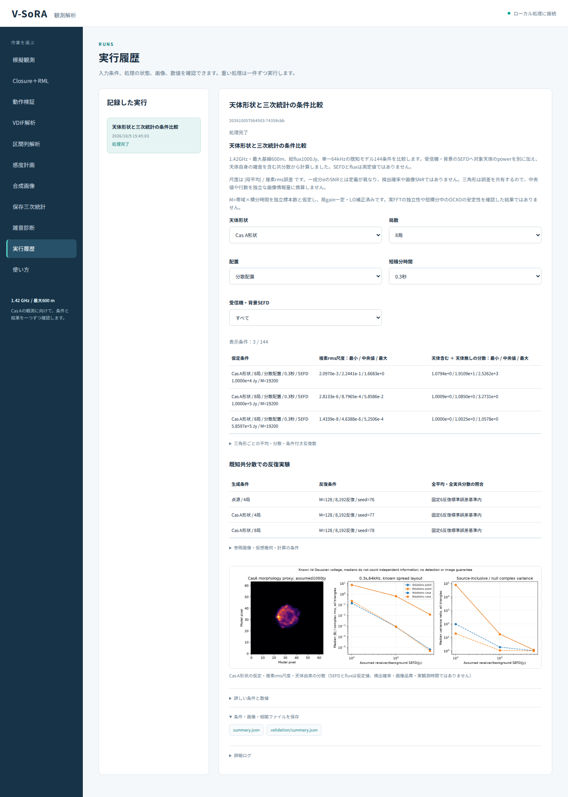

# 段階077：天体形状と三次統計の条件比較を日本語GUIで確認

- 作成日：2026-10-05
- 状態：完了
- 比較元コミット：9772fdc

## 読者向け概要

同じ総fluxでも、点源と広がったCas Aでは基線ごとの相関が違います。段階076の144条件を形状・局数・配置・短積分・感度で絞り込み、平均とばらつきを比較できる画面を作る段階です。

## 1. 目的・対象範囲

段階076の既知モデル比較を日本語GUIへ接続する。初期表示をCas A・8局・分散配置・0.3秒の3SEFDとし、すべての144条件と三角形ごとの詳細を選択できるようにする。尺度の定義、天体power、参照画像の時期、仮想幾何、独立標本と補正済みLOの仮定を説明する。

## 2. 完了条件

実workerで144条件と3反復実験を生成し、全JSONが段階076と完全一致すること。ソース・導入済みGUIの実Chromiumで144概要行、各条件の全三角形詳細、絞り込み、保存JSON、図説明、日本語フォントと390px画面を照合する。数値0の平均と反復数上限超過の表示は区別する。全回帰試験と配布ファイルの照合、匿名監査・コミットを完了する。

## 3. 実際に行った作業

`known_sky_bispectrum` の受付・日本語履歴名・実worker呼出しを追加した。形状・局数・配置・短積分時間・SEFDの5項目で条件を絞り込む。初期表示はCas A・8局・分散配置・0.3秒の3SEFDである。概要には三角形全体の尺度・分散比の最小/中央値/最大を表示し、選んだ条件の全三角形の平均・複素分散・尺度・条件付き反復数を詳細表示する。

尺度とSEFDの意味、独立標本・補正済みLO・同じS/uvの反復という仮定、参照画像の時期とSHA、EOP予測値を表示する。図説明もこの比較に合わせた。全共分散を含む科学JSONは元の形式で保存できる。

変更ファイル：`apps/ui/src/vsora_ui/models.py`、`jobs.py`、`worker.py`、`static/index.html`、`static/app.js`、`apps/ui/tests/test_server.py`、`tools/verify_bispectrum_known_sky_ui.py`、[GUIガイド](../guide/06-gui.md)、レポートと索引。

## 4. 検証条件・結果

対象の実worker・受付試験2件が3.64秒で合格した。対象選択により49件を非選択としたが、以下の全回帰試験には除外がない。警告1件は既存Starlette APIの非推奨警告である。

ソースと導入済みGUIの実Chromiumで、概要144条件、詳細4,320三角形行の平均・分散・尺度・反復数の表示を照合した。初期3条件、点源・4局・円周・0.1秒・SEFD10,000の1条件への絞り込みと初期条件への復帰を確認した。全科学JSONは段階076と完全一致し、ダウンロードでも一致した。3反復実験の条件と固定6標準誤差基準、参照時期・SHA、予測EOP、図説明を確認した。

数値0の平均と反復数上限超過は、表示専用fixtureで別文言となることを確認した。このfixtureは科学実験の条件を追加したものではない。ブラウザ照合の初回は整数865,165の概数表示でPythonの偶数丸めとJavaScriptの丸めが異なることを検出した。照合側でJavaScriptの整数概数の規則へ合わせ、平均・分散等の許容条件は変更していない。表示専用fixtureの詳細を閉じたまま文言を読む試験も失敗したため、詳細を開く操作を追加した。反復実験の表を作るだけで画面へ追加していない実装漏れも実ブラウザで検出し、表を追加して同じ全項目を再実行した。失敗ログはGit管理外に保持した。

| 確認 | 実測結果 |
|---|---|
| ソース全回帰試験 | 977件合格、25,596警告、560.13秒 |
| 導入済み全回帰試験 | 977件合格、25,596警告、560.35秒 |
| 配布ファイル | 76ファイルがソースとバイト一致 |
| 依存関係 | pip check成功 |

全回帰試験の除外0件。Python 3.12.3、NumPy 2.5.1、SciPy 1.18.0、pytest 8.4.2、Chromium 153.0.8010.12、BLAS/OpenMP各1スレッド。JavaScript例外0、外部リクエスト0、日本語フォント成功、390pxで横はみ出し0だった。Windowsの実ブラウザとWSLgは未検証。

wheelは5,517,795 bytes、SHA-256 `69039a9beb10dc2b4600fffb9fe01e7f6b5cc57d5dbc2f46fa85f565ae919982`。[検証記録](../../validation/runs/stage077/verification.json)、[ソースGUI](../../validation/runs/stage077/source-browser.json)、[導入済みGUI](../../validation/runs/stage077/browser.json)を保存した。科学計算詳細は[段階076の記録](../../validation/runs/stage076/known-sky-scale.json)と完全一致する。



[入力画面](../../validation/runs/stage077/input.png)、[390px画面](../../validation/runs/stage077/mobile.png)も保存した。スクリーンショットのメタデータは空である。詳細ログ・wheelはGit管理外の `outputs/stage077-source-final/`、`outputs/stage077-installed-final/`、各browserフォルダにある。

再実行例：

```bash
PLAYWRIGHT_BROWSERS_PATH=/tmp/vsora-browser \
OPENBLAS_NUM_THREADS=1 OMP_NUM_THREADS=1 \
  .verification-venv/bin/python tools/verify_bispectrum_known_sky_ui.py \
  --output outputs/stage077-reproduction --port 8787
```

ソースGUIは `tools/run.py tools.verify_bispectrum_known_sky_ui --source-checkout` を使う。ブラウザ実行環境を別途用意する必要がある。

## 5. 制約・未解決事項

SEFDと総fluxは仮定値で、実機の測定値ではない。三角形は誤差を共有し、中央値・行数は独立な画像情報量ではない。条件付き反復数は同じS・uvを保つ仮定の概数表示で、地球回転を含む実観測時間の推奨値ではない。JSONは整数と状態を保持する。workflowは作業ツリー側で動き、配布APIの独立照合は段階076で実施済みである。Windowsの実ブラウザ・WSLg・実RTL-SDR・画像復元の成功は未確認。

## 6. 次段階

Cas Aの形状と感度を含む模擬データの相関・画像復元を、短積分と局ごとの周波数差の条件で検討する。
