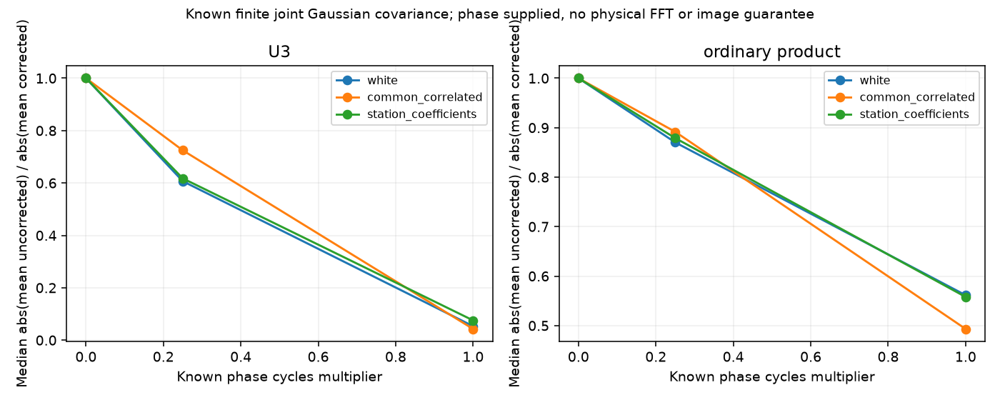

# 段階078：局別の時間変化を持つ既知Gaussian電圧の三次統計の平均

- 作成日：2026-10-05
- 状態：完了
- 比較元コミット：9889e3a

## 読者向け概要

各局の位相は同じ時刻の三角形積では打ち消されます。しかし異なる時刻の標本を掛けるU₃では、未補正の局位相変化が同じように消えるとは限りません。既知の小さい局×時刻の共分散を使い、この条件を直接計算する段階です。

## 1. 目的・対象範囲

共通S×Kに限らない既知の局・時間共分散から、proper Gaussian電圧の六つの縮約を足して通常積と異なる時刻のU₃の母平均を計算する。3〜32時刻、3〜8局の有限参照実装とし、時刻優先の軸順を明示する。固定局gainと変化する局位相、局別の模擬線形係数を比較する。LOを推定した補正、実ADC/FIR/VDIF、雑音共分散・尤度・画像復元は対象外。

## 2. 完了条件

小さい例の全縮約・全時刻三つ組と独立に照合する。共通S×Kの段階072、白色時間の段階059、固定gain・数値範囲・PSD・軸順・不正入力と一致/拒否条件を確認する。固定条件・seed・6反復標準誤差基準で全三角形の平均を照合し、既知逆位相を掛けた標本で不変性/非不変性を確認する。導入APIの作業ツリー外照合、ソース・導入済み全回帰試験、レポートと匿名監査・コミットを行う。

## 3. 実際に行った作業

局×時刻の全共分散 `C[t,i,u,j]` を受け取り、proper Gaussian電圧の6つの縮約を全時刻三つ組へ適用するAPIを追加した。通常積は全三つ組、U₃は異なる時刻の三つ組の平均を計算する。共通S×Kの形に限定しない。各時刻の母visibilityの積も保存し、局別位相で異なる時刻のU₃だけが変わる条件を比較できるようにした。

Hermitian・PSD・軸順・数値範囲を検査し、入力を変更しない。固定局gain、共通位相、白色時間、共通時間相関の既存式、全縮約による別の計算と照合した。

workflowには白色時間、共通AR係数0.4、局別3係数のモデルを用意した。4局は位相係数0/0.25/1の9条件、8局は0.25の3条件、計12条件である。各条件で位相変更前の同じ模擬電圧を使い、局別位相を掛けた場合と既知の逆位相を掛けた場合の通常積・U₃を比較する。失敗時もJSONと図を保存する。

変更ファイル：`apps/simulator/src/vsora_simulator/bispectrum_joint_temporal.py`、`apps/simulator/tests/test_bispectrum_joint_temporal.py`、`test_bispectrum_joint_temporal_validation.py`、`workflows/bispectrum_joint_temporal_validation.py`、`tools/verify_bispectrum_joint_temporal_installed.py`、[規約](../../interfaces/bispectrum-joint-temporal.md)、[学部生向け説明](../guide/07-closure-rml.md)、レポートと索引。

## 4. 検証条件・結果

### 4.1 対象試験と固定反復実験

正式対象58試験は1.12秒で合格した。全縮約、共通S×Kとの一致、32時刻・8局の上限、固定gain、共通位相、変化する局位相、零入力、三角形選択、範囲外入力、失敗記録を確認した。草稿56試験が1.16秒で合格した後、拡張精度入力の範囲外拒否を2件追加し、58試験が1.22秒で合格した。

正式実行は12条件・各8,192反復・8標本、seed78〜89。通常積/U₃と位相変更/既知逆位相の全三角形平均が固定6反復標準誤差基準内だった。正式実行2.68秒、最大RSS98,596 KiB。予備実行2.88秒、98,812 KiBで、全科学JSONは完全一致した。既知の逆位相を掛けた標本統計と元の標本統計の最大差は8.0261e-15だった。

8標本のモデル時刻を0〜0.3秒に配置し、局のrateは位相係数×[0,0.7,−0.4,1.2,…]/0.3 Hzとした。この8標本は実FFT数・M=帯域×時間の値ではない。白色/共通相関/局別係数は既知電圧共分散のモデルで、物理フィルターやADCを動かした実験ではない。

### 4.2 局別の時間変化の影響

以下は4局の全三角形における、**位相変更後U₃の母平均の絶対値 ÷ 既知逆位相後の絶対値の中央値**である。母平均の比較で、受信機のcoherence、検出確率、画像SNRではない。

| 既知時間モデル | 位相係数0 | 0.25 | 1 |
|---|---:|---:|---:|
| 白色時間 | 1 | 0.60679045 | 0.053324474 |
| 共通時間相関 | 1 | 0.72464258 | 0.042758221 |
| 局別線形係数 | 1 | 0.61748287 | 0.075415409 |

各時刻の母visibilityの三角形積は位相変更前後で一致した。一方で異なる時刻を掛けるU₃の母平均は変化した。白色時間・位相係数1では、最初の三角形の母平均が補正後0.008から未補正約−0.000877289へ変わり、符号も変わった。有限反復で偶然位相がずれたという主張ではなく、与えた既知モデルの母平均の計算値である。

この例では、同じ時刻のClosureで局位相が打ち消されるという性質だけを根拠に、異なる時刻を混ぜるU₃の局別位相変化を無視できない。逆位相は真値を供給しており、弱い実観測から周波数差を測れることは検証していない。時間相関を含む場合は、補正後のU₃も天体の母visibilityの積に一致すると保証しない。

### 4.3 ソフトウェア検証

作業ツリー外から導入済みAPIを読み、保存済みの既知共分散・モデル時刻・局rateから12条件を再構成した。2位相状態×2統計の48平均配列が完全一致した。誤差共分散や尤度を計算していないことも確認した。

| 確認 | 実測結果 |
|---|---|
| ソース全回帰試験 | 1035件合格、25,596警告、560.22秒 |
| 導入済み全回帰試験 | 1035件合格、25,596警告、558.45秒 |
| 配布ファイルの照合 | 77ファイルがソースとバイト一致 |
| 依存関係 | pip check成功 |

全回帰試験の除外0件。Python 3.12.3、NumPy 2.5.1、SciPy 1.18.0、pytest 8.4.2、BLAS/OpenMP各1スレッド。既存依存ソフトの非推奨API等の警告を含む。wheelは5,519,586 bytes、SHA-256 `bb0119e8c2fcd419fbf8cc1fa3060da33094a2a219fac9c2b3cd4cc427075ef9`。

[全計算記録](../../validation/runs/stage078/known-joint-time.json)、[検証記録](../../validation/runs/stage078/verification.json)、[導入済みAPI照合](../../validation/runs/stage078/installed-api.json)を保存した。



図の量は母平均の絶対値の比であり、全複素平均はJSONで確認できる。図のメタデータはMatplotlib名とdpiだけである。詳細ログ・wheelはGit管理外の `outputs/stage078-source-final/`、`outputs/stage078-installed-final/`、`outputs/stage078-source-monte-carlo/` にある。

再実行例：

```bash
OPENBLAS_NUM_THREADS=1 OMP_NUM_THREADS=1 \
  .verification-venv/bin/python tools/run.py \
  workflows.bispectrum_joint_temporal_validation \
  --output outputs/stage078-reproduction
```

配布API照合は `tools/verify_bispectrum_joint_temporal_installed.py --reference validation/runs/stage078/known-joint-time.json --output outputs/stage078-reproduction-api` を使う。

## 5. 制約・未解決事項

既知proper Gaussian共分散の母平均だけを計算する。三次統計の分布はGaussianと仮定しない。未知の局雑音・gain・時計を同じデータから推定する問題、標本のmask、量子化、画像品質の評価を含まない。模擬線形係数から作る共分散は実FFTの独立性やハードウェア測定ではない。有限32時刻の参照計算を実収録の全標本数へ外挿しない。

## 6. 次段階

結果を日本語GUIで確認し、実際の補正・収録条件との違いを説明する。
