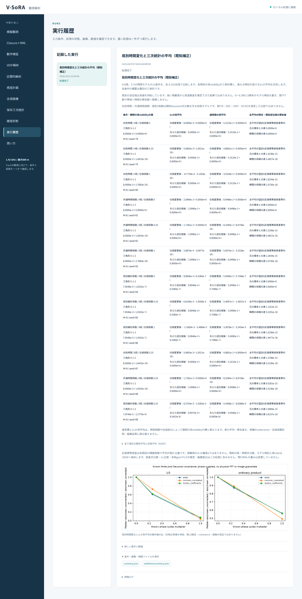

# 段階079：局別時間変化と三次統計の平均を日本語GUIで確認

- 作成日：2026-10-05
- 状態：完了
- 比較元コミット：720490c

## 読者向け概要

同じ時刻の局位相が三角形で打ち消されても、異なる時刻を掛ける三次統計では局別の時間変化の影響が残ります。段階078の有限モデルと、真値として与えた逆位相の結果を日本語GUIで比較します。

## 1. 目的・対象範囲

段階078の12条件を実workerで実行し、既知式・反復平均・反復標準誤差と、逆位相を与えた標本の差を表示する。初期概要は各条件の最初の三角形、詳細は全816条件・三角形・位相状態・方法の行を確認する。8標本のモデル時刻と物理FFT、与えた補正と観測から推定した補正を区別する。

## 2. 完了条件

実workerの全JSONが段階078と完全一致すること。ソース・導入済み実Chromiumで全12概要行・816詳細行の数値、保存JSON、図説明、日本語フォントと390px画面を照合する。対象試験・ソース/導入済み全回帰・配布バイト照合、学部生向けレポート・索引・匿名監査・コミットを完了する。

## 3. 実際に行った作業

`joint_temporal_bispectrum` の受付、日本語履歴名、段階078を呼ぶ実workerを追加した。概要12行は各条件の最初の三角形の瞬間の母visibilityの積、位相変更後/与えた逆位相後のU₃と通常積の母平均、全平均の照合、元の標本との最大差を表示する。詳細は全816行の既知式・反復平均・実部/虚部の反復標準誤差を表示する。

局別位相が同じ時刻の母積で打ち消されることと、異なる時刻のU₃への影響を説明した。逆位相は真値を与えること、8標本のモデル時刻を実FFTへ換算しないこと、既知係数モデルをハードウェア測定と区別することを明記した。図説明と保存JSONもこの比較に合わせた。

変更ファイル：`apps/ui/src/vsora_ui/models.py`、`jobs.py`、`worker.py`、`static/index.html`、`static/app.js`、`apps/ui/tests/test_server.py`、`tools/verify_bispectrum_joint_temporal_ui.py`、[GUIガイド](../guide/06-gui.md)、レポート・索引。

## 4. 検証条件・結果

実workerと受付の対象2試験が3.18秒で合格した。対象指定による非選択51件は、全回帰試験にはすべて含む。対象試験の警告1件は既存Starlette APIの非推奨警告である。

ソース・導入済みGUIの実Chromiumで12概要行、全816詳細行の複素平均・標準誤差・最大標本差・条件を照合した。全科学JSONと保存JSONは段階078と完全一致した。図の説明、供給した逆位相とモデル時刻の条件、日本語フォント、390px画面を確認した。JavaScript例外0、外部リクエスト0、横はみ出し0だった。

| 確認 | 実測結果 |
|---|---|
| ソース全回帰試験 | 1037件合格、25,596警告、566.35秒 |
| 導入済み全回帰試験 | 1037件合格、25,596警告、565.41秒 |
| 配布ファイル | 77ファイルがソースとバイト一致 |
| 依存関係 | pip check成功 |

全回帰試験の除外0件。Python 3.12.3、NumPy 2.5.1、SciPy 1.18.0、pytest 8.4.2、Chromium 153.0.8010.12、BLAS/OpenMP各1スレッド。既存依存ソフトの非推奨API等の警告を含む。Windowsの実ブラウザとWSLgは未検証。

wheelは5,520,637 bytes、SHA-256 `72f6daaf298077635c187c1be8494019e70d32c6dbb5d585f06c0ff645751169`。[検証記録](../../validation/runs/stage079/verification.json)、[ソースGUI](../../validation/runs/stage079/source-browser.json)、[導入済みGUI](../../validation/runs/stage079/browser.json)を保存した。科学計算は[段階078の記録](../../validation/runs/stage078/known-joint-time.json)と完全一致する。



[入力画面](../../validation/runs/stage079/input.png)、[390px画面](../../validation/runs/stage079/mobile.png)を保存した。スクリーンショットのメタデータは空である。詳細ログとwheelはGit管理外の `outputs/stage079-source-final/`、`outputs/stage079-installed-final/`、各browserフォルダにある。

再実行例：

```bash
PLAYWRIGHT_BROWSERS_PATH=/tmp/vsora-browser \
OPENBLAS_NUM_THREADS=1 OMP_NUM_THREADS=1 \
  .verification-venv/bin/python tools/verify_bispectrum_joint_temporal_ui.py \
  --output outputs/stage079-reproduction --port 8788
```

ソースGUIは `tools/run.py tools.verify_bispectrum_joint_temporal_ui --source-checkout` を使う。ブラウザ実行環境を別途用意する必要がある。

## 5. 制約・未解決事項

既知proper Gaussian共分散の母平均の比較である。逆位相は真値を供給する。実LOの推定、実FFTの独立性、未知局gain、誤差共分散・U₃尤度・位相信頼区間・画像復元を確認した結果ではない。全共分散入力をJSONへ保存する。workflowは作業ツリー側、配布APIの独立照合は段階078で行う。WSL headless Chromiumを対象とし、Windowsの実ブラウザとWSLgは未検証。

## 6. 次段階

局配置・最大基線長とCas Aの感度・形状情報を条件付きで比較する。
