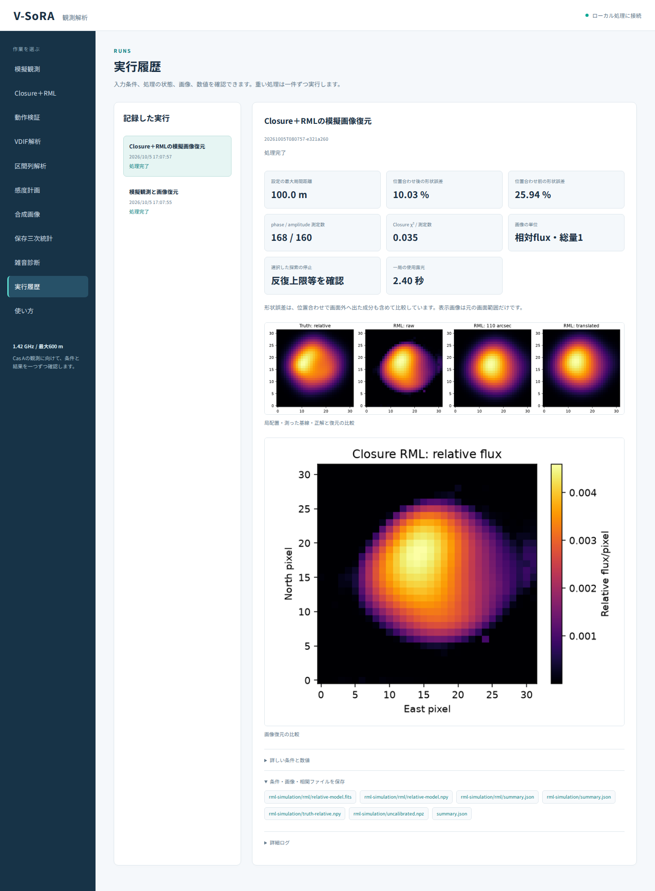

# 段階080：最大基線長を指定する模擬観測・RML・感度計画

- 作成日：2026-10-05
- 状態：完了
- 比較元コミット：4720b7a

## 読者向け概要

最大600mという条件は、すべての配置を600mに固定する意味ではありません。短い基線は強い相関を得やすく、長い基線は細かな角度情報を持つため、目的に合わせて比較します。模擬観測・Closure＋RML・感度計画の日本語GUIへ最大基線長の入力を追加する段階です。

## 1. 目的・対象範囲

4/8局・分散/直線/円周の仮想配置を、指定した最大局間距離へ縮小する共通APIを作る。GUIは10〜600mとし、既存の既定値600mでは同じ座標を生成する。模擬観測・Closure＋RML・感度計画で同じ規約を使い、設定と結果に実際の座標を保存する。VDIF解析の観測位置や物理アンテナを変更する処理は対象外。

## 2. 完了条件

全6配置、25/100/600m等で最大局間距離・並進前の相対形状・既定値の完全一致を確認する。不正局数・種類・非有限値・範囲外・masked入力を拒否する。実workerと実Chromiumで3入口を実行し、要求値と保存座標の最大距離が一致すること、初期値・日本語説明・390px表示を確認する。画像化の成功とoptimizer停止・形状の良さを混同しない。配布APIを作業ツリー外から照合し、ソース/導入済み全回帰、レポート・索引・匿名監査・コミットを完了する。

## 3. 実際に行った作業

`vsora_observation.layouts.reference_layout` を追加した。最大基線長を全局間距離の最大値と定義し、4/8局の分散・直線・円周の相対形状を保つ。既定値600mの6配置は、段階078の導入済みGUIからあらかじめ保存した独立JSONを比較値にした。

模擬観測・Closure＋RML・感度計画の3受付モデルへ `maximum_baseline_m` を追加した。共通workerで座標に反映し、感度計画の内部SimulationRequestにも渡す。日本語フォームとリクエストJSONを接続し、結果画面には保存座標から計算した「設定の最大局間距離」を表示する。固定条件の説明も入力に合わせた。

変更ファイル：`packages/observation/src/vsora_observation/layouts.py`、`packages/observation/tests/test_layouts.py`、`apps/ui/src/vsora_ui/models.py`、`worker.py`、`static/index.html`、`static/app.js`、`apps/ui/tests/test_server.py`、`tools/verify_layout_installed.py`、`tools/verify_layout_ui.py`、[配置規約](../../interfaces/array-layouts.md)、[GUIガイド](../guide/06-gui.md)、レポート・索引。

## 4. 検証条件・結果

### 4.1 対象試験と実ブラウザ

配置APIの46試験が0.06秒、GUI受付・座標・実workerの58試験が4.58秒で合格した。計104試験。GUI対象選択による非選択53件は、全回帰ではすべて含む。警告1件は既存Starlette APIの非推奨警告である。46草稿試験も0.09秒で合格した。

以下の3入口をソース・導入済みGUIの実Chromiumで実行した。入力の既定値600m、範囲10〜600m、日本語説明、要求値が保存ENU座標と結果表示に反映すること、全JSONのダウンロード一致を確認した。

| 入口 | 正式な模擬条件 | 結果 |
|---|---|---|
| 模擬観測 | 点源・4局・円周・最大50m、60秒の理想visibility、雑音なし | 処理完了、保存座標の最大距離50m |
| Closure＋RML | Cas A形状・8局・分散・最大100m、全体3600秒に8露光、各0.3秒、SEFD1000Jy、雑音なし、1初期値・上限100反復 | 処理完了、相対画像を保存、使用露光2.4秒。探索停止と画像品質を区別 |
| 感度計画 | 8局・直線・最大200m、直径1m/効率0.6/100K、0.3秒/256kHz、仮定flux1000Jy | 処理完了、期待高SNR phase/logamp数0/0を保持 |

100mのRML条件の位置合わせ後NRMSEは10.0280%、位置合わせ前は25.9426%。探索停止は `STOP: TOTAL NO. OF ITERATIONS REACHED LIMIT`、反復数100だった。これは入力機能の確認例で、100mを最適配置と推薦した結果やCas A画像品質の合格ではない。RMLの模擬雑音は既存の独立visibility近似で、天体電圧から自己雑音を生成した検証ではない。感度計画は天体総powerを加える別の既存近似を使う。

ソースと導入済みの設定・数値結果は完全一致した。実行時間と入力NPZコンテナのSHAは比較から除いた。RMLの入力SHAを消したのは比較記録のみで、原本ダウンロードと実処理の識別情報は保持する。数値結果と停止状態を[確認記録](../../validation/runs/stage080/numeric-results.json)へ保存した。

日本語フォント成功、各3入口の390px横はみ出し0、JavaScript例外0、外部リクエスト0だった。Windowsの実ブラウザとWSLgは未検証。

### 4.2 配布APIと全回帰

作業ツリー外から導入済みAPI・GUIモデル・workerを読み、既定6配置のバイト一致、18配置/距離の組合せ、模擬観測・RMLの保存configへの反映を照合した。感度計画の保存座標は実workerと実ブラウザでも確認した。

| 確認 | 実測結果 |
|---|---|
| ソース全回帰 | 1141件合格、25,596警告、570.62秒 |
| 導入済み全回帰 | 1141件合格、25,596警告、570.57秒 |
| 配布ファイル | 78ファイルがソースとバイト一致 |
| 依存関係 | pip check成功 |

全回帰の除外0件。既存依存ソフトの非推奨API等の警告を含む。Python 3.12.3、NumPy 2.5.1、SciPy 1.18.0、pytest 8.4.2、Chromium 153.0.8010.12、BLAS/OpenMP各1スレッド。wheelは5,521,472 bytes、SHA-256 `2717883ffbbcfd533db6247d77961ca3bfa6e9ea3cea892342d7bd55f3e924ff`。

[正式検証記録](../../validation/runs/stage080/verification.json)、[ソースGUI](../../validation/runs/stage080/source-browser.json)、[導入済みGUI](../../validation/runs/stage080/browser.json)、[導入API照合](../../validation/runs/stage080/installed-api.json)、[変更前の600m座標](../../validation/runs/stage080/legacy-layouts.json)を保存した。



[模擬観測](../../validation/runs/stage080/simulation-result.png)、[感度計画](../../validation/runs/stage080/sensitivity-result.png)、[390pxのRML画面](../../validation/runs/stage080/rml-mobile.png)、[入力例](../../validation/runs/stage080/rml-input.png)も保存した。全9スクリーンショットのメタデータは空である。詳細ログとwheelはGit管理外の `outputs/stage080-source-final/`、`outputs/stage080-installed-final/`、各browserフォルダにある。

再実行例：

```bash
PLAYWRIGHT_BROWSERS_PATH=/tmp/vsora-browser \
OPENBLAS_NUM_THREADS=1 OMP_NUM_THREADS=1 \
  .verification-venv/bin/python tools/verify_layout_ui.py \
  --output outputs/stage080-reproduction --port 8789
```

ソースGUIは `tools/run.py tools.verify_layout_ui --source-checkout` を使う。配布APIは `tools/verify_layout_installed.py --reference validation/runs/stage080/legacy-layouts.json --output outputs/stage080-reproduction-api` で照合できる。

## 5. 制約・未解決事項

仮想配置は既存の形を縮小したもの。アンテナの寸法・間隔・相互結合・敷地・局別beamや実SEFDは評価しない。小さい最大基線で相関やClosure数が増えても、細かな形状を復元できるという意味ではない。模擬RMLと感度計画の既存雑音近似・LO補正済みの仮定を維持し、低SNRの尤度は変更しない。実RTL-SDRとWindows収録ソフトは対象外。

## 6. 次段階

最大基線と相関強度・角度情報の条件比較を行う。
