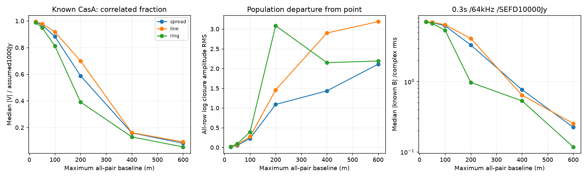

# 段階081：最大基線長と既知Cas A形状の条件付き比較

- 作成日：2026-10-05
- 状態：完了
- 比較元コミット：13e15a2

## 読者向け概要

近いアンテナ同士では、大きく広がった天体もほぼ点に見え、強い相関信号を得やすくなります。しかし点と広がった形状を区別する変化は小さくなります。この段階では、最大距離25〜600mの配置で、この2つの傾向を既知のCas A画像から計算します。

母集団closureとは、無限に多くの電圧標本があると仮定した相関から求める、局ごとの一定gainが相殺する量です。実際の短い収録から計算したclosureには誤差があるため、母集団の値とは区別します。

## 1. 目的・対象範囲

8局の分散・直線・円周の3形状を25/50/100/200/400/600mへ縮小する。単一時刻で相関flux、点源からの母集団closureの差、天体自己雑音を含む既知天空U3のcomplex-rms尺度を並べる。Windows収録・実観測・画像復元は対象外。

## 2. 完了条件

母集団closure指標の点源・局別gain不変性・微小visibilityのマスクを試験する。18配置の最大距離、投影fringe周期、天空Gramとdirect visibilityを照合する。108条件の平均・分散・尺度を導入済みAPIと完全照合する。ソース/導入済み全回帰、学部生向け日本語レポート・索引・匿名監査・commit/pushを行う。

## 3. 実際に行った作業

母集団visibilityのphase/logampへ既存closure designを適用する `population_closure_signature` を追加した。点源からの差を有効な全行のRMS・最大絶対値でまとめ、全行と無効マスクも保存する。数値床 `総flux×10⁻¹²` 以下のvisibilityが必要な行は値をnullにする。この床は数値計算の規約で、SNR判定ではない。

workflowは共有配置APIで18配置を作り、64画素・16arcsecの既知Cas A形状を用いた相関値を生成する。最大局間距離・投影基線・EOP・入力画像SHA・全母集団closureを保存する。同じ電圧モデルから作る天空Gramのoff-diagonalをdirect visibilityと照合した。SEFD3値×積分2値について既存の天体自己雑音を含む厳密な既知Gaussian電圧の平均・分散APIを流用し、108条件を計算する。

変更ファイル：`apps/simulator/src/vsora_simulator/array_shape.py`、`apps/simulator/tests/test_array_shape.py`、`test_array_scale_validation.py`、`workflows/array_scale_validation.py`、`tools/verify_array_scale_installed.py`、[規約](../../interfaces/array-scale-comparison.md)、[感度ガイド](../guide/08-sensitivity.md)、レポート・索引。

## 4. 検証条件・結果

### 4.1 対象試験と正式な条件計算

49対象試験が1.78秒で合格した。点源、局別一定複素gainの相殺、無効行のnull、空のclosure群、不正入力・数値範囲、18配置の最大距離・fringe定義・尺度レコード・保存規約を確認した。

草稿の初回では3局のamplitude RMSを0と期待し、1件が失敗した。3局にはamplitudeの四辺がなく、nullが正しいため期待値を修正した。29草稿試験が0.08秒で合格した。正式対象の初回は投影基線の厳密な相対比例性で15件が失敗した。既存geometryが地球中心から数百万mの位置を作り、その後局間差を計算するため、浮動小数点の引き算の差が含まれる。地球規模6.4Mmの64ulp、約60nmに対応する絶対誤差上限を波長へ換算する検証へ修正した。fringe周期の定義そのものは相対10⁻¹⁴で確認する。天空条件・API・予備数値結果は変更していない。

正式計算は18配置・108条件。全科学JSONが予備結果と完全一致した。正式実行1.42秒、最大RSS193,280 KiB。予備計算は1.50秒、209,248 KiB。初回の直接Python起動では新しいソースmoduleのパス不足で計算開始前に失敗したため、正式実行はソースsrcのパスを設定して行った。公開の再実行には `tools/run.py` を使う。

天空Gramとdirect visibilityの最大差は1.2182e-12 Jy、点源の母集団closure最大絶対値は0.0000e+00だった。参照画像SHAは `cb9ef1efbcd4011bcfd8ea9b6b9553f36005d08f8c9d26a65439b45e18130663`。EOP statusは2（予測）で、仮想時刻の高度は32.4514度。実測の観測条件ではない。

この段階では新しいMonte Carlo反復は実施していない。流用した既知天空の電圧平均・分散は[段階076](076-bispectrum-known-sky-scale.md)等で反復検証済みだが、081の18配置の有限標本分布を今回測定したという意味ではない。

### 4.2 強さと形状差の計算値

以下は8局・分散配置の例。phase RMSは母集団の主値位相を度へ換算し、logampは自然対数の無次元値。U3尺度は0.3秒・64kHzの全56三角形の中央値で、母平均の絶対値÷複素rms誤差を表す。

| 最大局間距離 | 相関flux比の中央値 | phase RMS（度） | logamp RMS | U3尺度：SEFD1万Jy | U3尺度：SEFD約58.6万Jy | 最小fringe周期（arcsec） |
|---|---:|---:|---:|---:|---:|---:|
| 25m | 0.992364 | 0.00275492 | 0.0132218 | 7.13019 | 0.0118379 | 1743.53 |
| 100m | 0.882724 | 0.205412 | 0.22918 | 6.23208 | 0.0081258 | 435.882 |
| 600m | 0.0820716 | 76.4087 | 2.11067 | 0.224407 | 4.63885e-06 | 72.6469 |

25mでは強い相関を得る一方、母集団closureは点源の0に近い。600mでは点源からの差が大きくなっても、相関fluxとU3尺度は弱まる。**U3の母平均を検出する尺度は、形状の差を検出する尺度ではない。** 誤差を持つ観測closureでこの形状差を区別できるかは、別の検証が必要である。

円周配置の200m付近ではlogamp RMSが大きくなる。対数は小さいvisibilityに敏感なため、この増加を情報量の増加と断定しない。全行RMSは共有baseline・重複行を含み、最適配置や復元成功は選んでいない。

### 4.3 ソフトウェア検証

作業ツリー外から導入済みAPIと同梱画像を使用し、画像SHA・18配置座標・18母集団signatureを照合した。既知画像と保存された投影座標から108条件の全三角形平均・複素分散・complex-rms尺度が完全一致した。導入API照合で時刻のAstropy投影を再計算したわけではない。geometry自体はソース実験と両全回帰で検証した。

| 確認 | 実測結果 |
|---|---|
| ソース全回帰 | 1190件合格、25,596警告、570.64秒 |
| 導入済み全回帰 | 1190件合格、25,596警告、569.57秒 |
| 配布ファイル | 79ファイルがソースとバイト一致 |
| 依存関係 | pip check成功 |

全回帰除外0件。Python 3.12.3、NumPy 2.5.1、SciPy 1.18.0、pytest 8.4.2、BLAS/OpenMP各1スレッド。既存依存ソフトの非推奨警告等を含む。wheelは5,522,920 bytes、SHA-256 `79f5308e618a37ec55f18027ea917085e89edda0c9a9c2524e7e73f0a8d5321c`。

[全科学JSON](../../validation/runs/stage081/known-array-scale.json)、[検証記録](../../validation/runs/stage081/verification.json)、[導入API照合](../../validation/runs/stage081/installed-api.json)を保存した。新しいGUIは次段階で接続する。



図のメタデータはMatplotlib名とdpiだけ。ログ・wheel・予備結果はGit管理外の `outputs/stage081-source-final/`、`outputs/stage081-installed-final/`、`outputs/stage081-source-experiment/`、`outputs/stage081-preliminary/` にある。

再実行：

```bash
OPENBLAS_NUM_THREADS=1 OMP_NUM_THREADS=1 \
  .verification-venv/bin/python tools/run.py workflows.array_scale_validation \
  --output outputs/stage081-reproduction
```

導入APIは `tools/verify_array_scale_installed.py --reference validation/runs/stage081/known-array-scale.json --output outputs/stage081-reproduction-api` で照合する。

## 5. 制約・未解決事項

既知2017年画像を1.42GHzの形状代理に使い、総flux1000Jyを別に仮定する。仮想地点35/135度、2026-10-02T08:00Zから300秒の単一時刻。SEFD1000/10000Jyおよび直径1m・効率0.6・100Kの計算値、64kHz・0.3/3秒、LO既知補正と一定gainを仮定する。独立電圧数を帯域×時間と置く仮定は実機で検証していない。

closureの全行RMSは独立画像情報量ではない。fringe周期は復元画像のbeam幅ではない。母集団形状差とU3 complex-rms尺度は別の統計量で、両者を組み合わせた検出確率や低SNR尤度は計算しない。時刻が異なる窓の合算や最適配置・観測時間・画像品質は判定しない。局別beam、実SEFD、時計誤差、量子化、相互結合、アンテナ寸法は未検証。

## 6. 次段階

日本語GUIへ配置比較を接続し、入力条件と各指標の意味を確認できるようにする。その後、現実的な低SNR電圧から形状を識別する評価へ進む。
