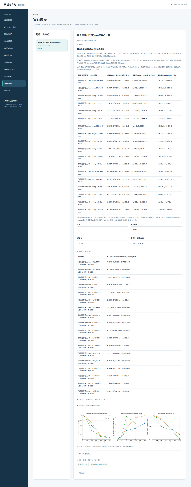

# 段階082：最大基線と既知Cas A形状の日本語比較画面

- 作成日：2026-10-05
- 状態：完了
- 比較元コミット：80ca607

## 読者向け概要

最大基線を短くすると強い相関を得やすくても、広がった天体と点源を見分ける差は小さくなります。[段階081](081-array-scale-known-sky.md)の計算を日本語画面で比較し、条件と意味を確認しながら保存する段階です。

## 1. 目的・対象範囲

動作検証へ「最大基線と既知Cas A形状の比較」を追加する。18母集団概要と108尺度条件を表示し、配置・最大基線・SEFD・積分で絞り込む。全三角形の既知平均・分散・尺度を確認し、保存JSONへつなぐ。固定された仮想条件であり、実観測入力や画像復元は対象外。

## 2. 完了条件

実workerの対象2試験、両実Chromiumで18概要・108条件・6048三角形の表示数値を段階081と照合する。フィルター・日本語・390px・caption・JSONダウンロードを確認し、JavaScript例外・外部リクエスト0を確認する。ソース/導入済み全回帰、レポート・索引・個人情報監査・匿名commit/pushを完了する。

## 3. 実際に行った作業

既存の動作検証へ `array_scale` を追加した。18配置の母集団概要では最大距離・fringe周期・相関flux比・phase/logampのRMSと最大値を表示する。尺度条件は配置・最大基線・積分・SEFDで絞り込み、各三角形の既知平均・複素分散・complex-rms尺度を詳細で確認できる。初期表示は全18配置、0.3秒・SEFD1万Jyである。

参照画像SHA・2017年の周波数・仮想時刻・EOP予測・LO既知補正と独立電圧数の仮定を日本語で示した。数値床、母集団の形状差とU3尺度の区別、最適配置・画像成功の未判定を本文と図のcaptionへ表示する。数値計算とRMLの重みは変更していない。

変更ファイル：`apps/ui/src/vsora_ui/models.py`、`jobs.py`、`worker.py`、`static/index.html`、`static/app.js`、`apps/ui/tests/test_server.py`、`tools/verify_array_scale_ui.py`、[GUIガイド](../guide/06-gui.md)、レポート・索引。

## 4. 検証条件・結果

### 4.1 対象試験と実ブラウザ

実workerと受付・画面項目の対象2試験が2.28秒で合格した。対象選択の非選択111件は全回帰にすべて含めた。警告1件は既存Starlette APIの非推奨警告である。

ソースGUIと導入済みGUIの実Chromiumで処理を実行し、以下を確認した。

- 18母集団概要の全表示値：距離・fringe周期・相関flux比・phase/logampのRMSと最大値。
- 108条件の全表示値：配置・最大基線・SEFD・積分・仮定標本数・尺度の最小/中央値/最大。
- 条件ごとの56三角形、計6048行の既知複素平均・複素分散・尺度。
- 4フィルターで全108条件から単一100m条件を選び、初期18条件へ戻る操作。
- 原本JSONのダウンロード一致、参照SHA・仮想時刻・予測EOP、各指標の限界とcaption。

両GUIの全科学JSONは[段階081の記録](../../validation/runs/stage081/known-array-scale.json)と完全一致した。日本語フォント成功、390pxで横はみ出し0、JavaScript例外0、外部リクエスト0だった。WSLのheadless Chromiumによる確認で、Windows実ブラウザやWSLgの確認ではない。

導入済みの外側GUIとworkerを作業ツリー外で実行した。固定検証workflowはcheckoutの `tools/run.py` を使うため科学moduleはソース版である。これと別に作業ツリー外の導入済みcore API・同梱画像で18配置と108条件を再照合し、平均・分散・尺度の完全一致を確認した。

### 4.2 配布と全回帰

| 確認 | 実測結果 |
|---|---|
| ソース全回帰 | 1192件合格、25,596警告、573.57秒 |
| 導入済み全回帰 | 1192件合格、25,596警告、570.77秒 |
| 配布ファイル | 79ファイルがソースとバイト一致 |
| 依存関係 | pip check成功 |

全回帰除外0件。Python 3.12.3、NumPy 2.5.1、SciPy 1.18.0、pytest 8.4.2、Chromium 153.0.8010.12、BLAS/OpenMP各1スレッド。既存依存ソフトの非推奨API等の警告を含む。wheelは5,524,350 bytes、SHA-256 `c5916eaec9b50a6943d63b1189af676407c489ffa09e6cebf509e4ec515b34bb`。

[正式検証記録](../../validation/runs/stage082/verification.json)、[ソースGUI](../../validation/runs/stage082/source-browser.json)、[導入済みGUI](../../validation/runs/stage082/browser.json)、[導入API照合](../../validation/runs/stage082/installed-api.json)を保存した。



[入力例](../../validation/runs/stage082/input.png)、[390px表示](../../validation/runs/stage082/mobile.png)も保存した。スクリーンショットのメタデータは空である。ログ・wheelはGit管理外の `outputs/stage082-source-final/`、`outputs/stage082-installed-final/`、各browserフォルダにある。

再実行：

```bash
PLAYWRIGHT_BROWSERS_PATH=/tmp/vsora-browser \
OPENBLAS_NUM_THREADS=1 OMP_NUM_THREADS=1 \
  .verification-venv/bin/python tools/verify_array_scale_ui.py \
  --output outputs/stage082-reproduction --port 8790
```

ソースGUIは `tools/run.py tools.verify_array_scale_ui --source-checkout`。配布APIは `tools/verify_array_scale_installed.py --reference validation/runs/stage081/known-array-scale.json --output outputs/stage082-reproduction-api` を使う。

## 5. 制約・未解決事項

母集団の点源との差とU3誤差尺度を組み合わせた形状検出確率は計算しない。全行RMSは独立情報量ではなく、fringe周期も復元beamではない。SEFD・総flux・LO既知補正・独立電圧数を仮定し、画像成功や最適配置・観測時間は判定しない。Windowsブラウザ・WSLg・実RTL-SDRは未検証。

## 6. 次段階

実現可能性を評価するため、低SNRの有限電圧標本で形状差の見分け方と局別gain/LOの扱いを検討する。残量・期限に合わせて目的と完了条件を決める。
