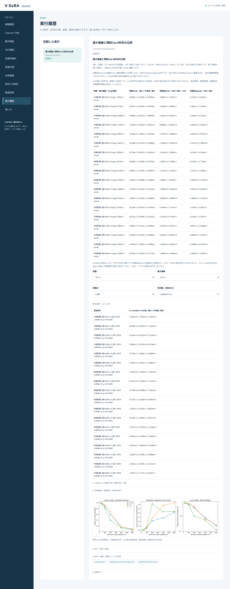

# 段階083：同梱データだけで実行する配置比較

- 作成日：2026-10-05
- 状態：完了
- 比較元コミット：6a03165

## 読者向け概要

画像や統計の計算結果が同じでも、ソフトを別の場所へ導入すると設定ファイルを見つけられないことがあります。この段階では、配置比較に必要な設定をソフトへ同梱し、リポジトリの実行スクリプトがない作業フォルダでも日本語画面から同じ比較を実行できるようにします。

## 1. 目的・対象範囲

段階081/082の配置比較を配布済みsimulator moduleへ移し、固定設定assetを同梱する。旧workflowのコマンドは互換wrapperとして維持する。GUI workerから計算APIを直接呼び、利用可能な検証項目を環境に合わせて選べるようにする。その他の検証は既存checkout要件を維持する。

## 2. 完了条件

固定設定のバイト/SHA一致、従来全科学JSONとの一致、設定assetと受付・利用可能項目の対象4試験を確認する。作業ツリー外・PYTHONPATH除去・tools/run.pyなしの両実Chromium、導入済み科学moduleと参照assetのprefix所属、単独CLIと全回帰を確認する。日本語レポート・索引・個人情報監査・匿名commit/pushを完了する。

## 3. 実際に行った作業

配置比較の計算を `vsora_simulator.array_scale` へ移した。固定設定の出発点を `known-array-scale-config.json` として同梱し、参照解決APIとwheelのdata filesへ登録した。設定の内容は既存 `ideal-point.json` とバイト一致し、計算時にCas A・18配置等へ変更する処理は従来と同じである。旧 `workflows.array_scale_validation` は互換wrapperとして公開コマンドを維持する。

GUI workerは配置比較APIを直接呼ぶ。実行元の検証記録をsidecar JSONへ保存し、科学module・同梱設定・参照画像が導入先に属するかをパスを公開せず記録する。科学結果JSONは変更しない。

環境APIは利用可能な検証一覧を返し、リポジトリのrunnerがない場所では配置比較だけを有効にする。日本語画面の検証ボタンと初期選択を合わせ、利用できない項目を無効にする。他の検証のcheckout要件は継続する。

変更ファイル：`apps/simulator/src/vsora_simulator/array_scale.py`、`workflows/array_scale_validation.py`、`data/reference/known-array-scale-config.json`、`pyproject.toml`、`packages/observation/src/vsora_observation/reference.py`、`packages/observation/tests/test_reference_config.py`、`apps/ui/src/vsora_ui/worker.py`、`server.py`、`static/app.js`、`apps/ui/tests/test_server.py`、`tools/verify_native_array_scale_installed.py`、`tools/verify_native_array_scale_ui.py`、[GUIガイド](../guide/06-gui.md)、[比較規約](../../interfaces/array-scale-comparison.md)、レポート・索引。

## 4. 検証条件・結果

### 4.1 対象試験と単独実行

設定assetの2試験が0.01秒、GUI受付・利用可能項目・runnerなしworkerの2試験が2.90秒で合格した。計4試験。GUI非選択113件は全回帰へ含め、警告1件は既存Starlette APIの非推奨警告である。

ソースGUIと導入済みGUIの実Chromiumを、リポジトリ外の作業フォルダで実行した。作業フォルダには `tools/run.py` を作らず、起動時のPYTHONPATHを除去した。ソースGUIではJobManagerが自分のcheckoutをworkerのimportへ設定するが、配置比較の計算はcheckoutのworkflow runnerを呼ばない。導入済みGUIでは、workerが読み込んだ全科学moduleと固定設定・天空画像が導入先prefix内にあることをsidecarで確認した。

18概要・108条件・6048三角形の表示数値、フィルター、全JSONダウンロード、caption、仮定の説明を両ブラウザで照合した。全科学JSONは[段階081](../../validation/runs/stage081/known-array-scale.json)と完全一致した。日本語フォント成功、390px横はみ出し0、JavaScript例外0、外部リクエスト0。Windows実ブラウザ・WSLgは未検証。

導入済みCLIも別の一時フォルダ・PYTHONPATH除去・runnerなしで実行した。科学moduleと同梱assetの所属・SHAを照合し、18配置・108条件の全科学JSONが従来と完全一致した。平均・分散・物理条件の変更はない。

### 4.2 配布と全回帰

| 確認 | 実測結果 |
|---|---|
| ソース全回帰 | 1196件合格、25,596警告、564.85秒 |
| 導入済み全回帰 | 1196件合格、25,596警告、572.54秒 |
| 配布module/GUIファイル | 80ファイルがソースとバイト一致 |
| 同梱設定 | 従来設定とバイト一致 |
| 依存関係 | pip check成功 |

全回帰除外0件。Python 3.12.3、NumPy 2.5.1、SciPy 1.18.0、pytest 8.4.2、Chromium 153.0.8010.12、BLAS/OpenMP各1スレッド。既存依存ソフトの非推奨API等の警告を含む。wheelは5,529,379 bytes、SHA-256 `80b41a9b49320066e51ebe834f61c0e4177b659700cf4d8c9606a4c47a760bbc`。

[検証記録](../../validation/runs/stage083/verification.json)、[ソースGUI](../../validation/runs/stage083/source-browser.json)、[導入済みGUI](../../validation/runs/stage083/browser.json)、[導入CLI](../../validation/runs/stage083/installed-cli.json)、[ソースの実行元](../../validation/runs/stage083/source-execution-origin.json)、[導入workerの実行元](../../validation/runs/stage083/installed-execution-origin.json)を保存した。



[入力](../../validation/runs/stage083/input.png)、[390px](../../validation/runs/stage083/mobile.png)も保存した。スクリーンショットのメタデータは空。ログ・wheelはGit管理外の `outputs/stage083-source-final/`、`outputs/stage083-installed-final/`、各browserフォルダにある。

導入済みCLI：

```bash
python -m vsora_simulator.array_scale --output outputs/array-comparison
```

導入済みGUIの照合：

```bash
PLAYWRIGHT_BROWSERS_PATH=/tmp/vsora-browser \
OPENBLAS_NUM_THREADS=1 OMP_NUM_THREADS=1 \
  .verification-venv/bin/python tools/verify_native_array_scale_ui.py \
  --output outputs/stage083-reproduction --port 8791
```

ソースGUIは `tools/run.py tools.verify_native_array_scale_ui --source-checkout`。独立CLI照合は `tools/verify_native_array_scale_installed.py --reference validation/runs/stage081/known-array-scale.json --output outputs/stage083-reproduction-cli` で行う。

### 4.3 導入時の修正

最初の導入コマンドではwheel名を `vsora-*.whl` と指定したが、実際の配布名は `v_sora-0.1.0-py3-none-any.whl` だった。この導入は失敗し、続く独立CLI照合も旧導入版のため失敗した。正しいファイル名で再導入し、pip checkと独立CLI照合を再実行して成功した。ソース・科学条件・照合基準は変更していない。失敗した試行は合格数に含めない。

## 5. 制約・未解決事項

配布単独実行へ移すのは固定配置比較である。他の検証にはリポジトリが必要。実観測での低SNR画像化・未知LO推定・実SEFDの測定は未検証。母集団形状差とU3尺度・最適配置の未判定を維持し、数学・物理仮定・RMLの重みは変更しない。Windows実ブラウザ・WSLgは未検証。

## 6. 次段階

低SNRの有限標本で形状を区別する評価と、実観測入力・局別gain/LOの扱いを進める。期限・残量を確認して次の目的と完了条件を決める。
