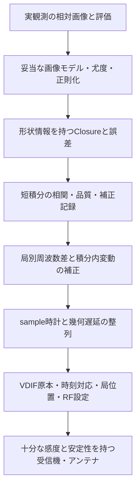

# 最終目標から逆算した必要要素と現在の進捗

- 整理日：2026-10-06
- 対象：段階083（`1a9afea`）までの実装・検証
- 読者：電気・情報・機械等の工学系学部生
- この文書の役割：各要素が必要な理由、確認済みの範囲、実観測で残る完了条件を説明する

開発の実施順と判断の経緯は、別の[時系列レポート](development-history.md)にまとめた。この文書は、最終的に必要な成果から順に読み直す。

## 1. 何ができれば最終目標を達成したと言えるか

目標は、OCXOへ改造したRTL-SDRと自作アンテナで記録した実データから、Cas Aの形を説明できる画像を得て、その処理を観測者が再実行できるソフトを完成させることである。観測周波数は1.42GHz、最大基線は約600m。精密な局gain較正が困難なためClosure＋RMLを主経路とし、一積分は数百ms〜数秒、局ごとの中心周波数差を想定する。

「画像ファイルが出る」だけでは完了としない。実観測の受入条件として、少なくとも次を定義・確認する必要がある。以下は今後満たすべき条件であり、達成済みの一覧ではない。

1. 使用した原本、時刻対応、局位置、RF設定、欠損と品質が追える。
2. sample時計と幾何遅延が整い、周波数差を補正した後に短積分の信号が残る。
3. 感度と誤差を実測または検証したモデルで説明し、情報不足の区間を採用しない。
4. Cas Aを検出したことと、点源等から広がった形を区別したことを分けて評価する。
5. 事前条件・初期画像・解析設定を変えたときの結果、残差、不確かさ、失敗を記録する。
6. 観測全体を現実的な容量・時間で処理し、再実行と結果の保存を行える。

達成を判定する画質、観測時間、成功率の数値基準は、実装置の感度と評価対象を確定してから設定する。現在の反復上限や模擬NRMSEを、そのまま実観測の合格基準にしていない。

## 2. 画像から入力へ逆算する

画像を信頼するには、その画像を説明する相関データが必要である。相関データを信頼するには、同じ瞬間の電圧が必要である。同じ瞬間を選ぶには、電圧のsample番号と時刻、局の時計と位置が必要になる。



この図は依存関係である。すべてを下から一度だけ作ればよいという意味ではない。有限模擬データで上下を往復して、どの要素が失敗の原因になるかを調べる必要がある。

## 3. 進捗の読み方

実装の存在と、実装が現実の条件に通用することを別々に示す。以下の語を使う。

| 表記 | 意味 |
| --- | --- |
| 仕様・仮定を整理 | 入出力や計算条件を記載した段階。装置の測定やソフトの完成を含まない |
| 参照実装・有限模擬検証 | CPU実装を作り、指定した有限データで成功・失敗を確認した段階 |
| 既知モデルの検証 | 真値や共分散を与えて式・反復結果を確認した段階。未知観測への適用は別 |
| 操作・配布を検証 | CLI、GUI、導入環境、保存結果の整合を確認した段階 |
| 実機・実運用を検証 | 実受信機と観測全体で成立を確認した段階。本観測系のCas A画像化は未到達 |

これらは単純な完成率の段階ではない。例えば、誤差の理論APIが十分検証されていても、画像化へ未接続なら画像ソフト全体の完成度には直接換算できない。所要作業量や実装置の条件が未確定なため、根拠のない総合パーセントは付けない。

### 要素別の現在地

| 必要な要素 | 現在の進捗 | 残る主な完了条件 |
| --- | --- | --- |
| アンテナ・RTL-SDR・OCXOの特性 | 仕様前提と感度の仮定を整理 | 実SEFD、主ビーム、初期周波数差、位相安定性、欠損を測る |
| Windows収録フロントエンド | 今回の開発対象外。必要な保存情報を整理 | ハードウェアに合わせて収録と時刻対応を実装・測定する |
| IQ・VDIF・補足設定 | 限定profileの参照実装・有限模擬検証 | 実装置のI/Q、sample/UTC、設定変更と欠損の保存を確認する |
| sample時計・幾何遅延 | 与えた時計モデルによる整列を有限模擬検証 | 実時計モデルを測り、精度と適用時間を確定する |
| 局別周波数差と変動 | モデル不要pilot、一定/線形rate補正、診断を実装 | 弱い実信号での採用率・alias・残留位相変動を確認する |
| FX相関と保存 | 分割CPU処理、channel・重み・flag、FITS-IDI/CASA接続を検証 | 実入力、bandpass、偏波、全夜の容量と速度を確認する |
| RFI・品質診断 | 指定した模擬条件、保存値とGUIを検証 | 実電波環境で閾値・誤除外・見逃しを評価する |
| Closure | 一定局gainの不変性、独立集合、共有基線の共分散を検証 | 時間・周波数・主ビーム等の実際の適用範囲を確かめる |
| 雑音モデル | 標本推定と既知全共分散等の診断を追加 | 実FFT相関、自己雑音、推定誤差を画像尤度へ接続する |
| 三次統計U₃ | 理論・反復検証、追加和保存、再計算GUIを実装 | 弱い未知観測での分布・gain・LO・画像化を検証する |
| Closure＋RML画像化 | 高SNR参照実装、有限模擬画像、CLI/GUIを検証 | 低SNR尤度、画像の不確かさ、実Cas Aでの形状評価を行う |
| 短露光合成・区間列 | 有限window列・露光保持・途中失敗保存を実装 | 全観測の自動再開、容量、速度、安定性を確認する |
| 局配置・観測条件の検討 | 最大基線入力、既知Cas Aの18配置・108条件比較 | 実感度・敷地・有限雑音の形状識別から配置を選ぶ |
| GUI・配布・再現性 | 日本語実ブラウザ、source/wheel、単独配置比較を検証 | Windows実ブラウザ、実入力の運用、各検証の導入要件を確認する |
| GPU・長時間性能 | CPU参照実装の有限測定。GPU実装は未完成 | 全観測を測り、重い工程を選んで高速化を検証する |

## 4. 受信機とアンテナ：画像に使える電圧を得る

### なぜ必要か

Cas Aの総fluxが大きくても、広がった天体は基線によって相関fluxが小さくなる。アンテナ面積が小さい、受信機雑音が大きい、主ビームが対象を十分覆わない場合には、短積分で使える相関が得られない。Closureはgainを相殺するが、電波そのものを強くする処理ではない。

SEFDは「その受信機の雑音に相当する天体flux」をJyで表す量である。受信機雑音を中心とする単純な近似では、相関の実部・虚部それぞれの雑音尺度は次の形で小さくなる。

```text
sigma ≈ sqrt(SEFD_i × SEFD_j / (2 × channel帯域 × 積分時間))
```

これは仮定した単位・独立標本・効率等の条件の式であり、天体自己雑音や時間相関まで含む一般の誤差ではない。Jy較正のないADC²データに、仮定したJyのsigmaをそのまま付けることもしない。

### 現在の進捗と次の確認

[感度計画025](../025-sensitivity-planning.md)と[入門ガイド](../../guide/08-sensitivity.md)には、アンテナ面積・雑音温度・短積分の条件付き計算がある。実際の自作アンテナとRTL-SDRのSEFDは未測定である。OCXOの良好な仕様だけでは、sample開始時刻、局間初期差、温度変化、短時間位相安定性が確認されたことにはならない。

ハードウェアが用意できた段階で、共通の試験信号等によるI/Qと時計の確認、位相変動、感度、RFI、飽和・欠損の測定を行い、仮定値を実測へ置き換える。具体的な接続・測定手順は装置仕様を踏まえて確定する。

## 5. 収録形式と補足情報：同じ瞬間・同じ条件の電圧を選ぶ

### なぜVDIF以外も必要か

VDIFは電圧と局識別・時刻等を保存する形式だが、ヘッダーの時刻が実sampleに対応することの証拠までは作れない。USB到着時刻は、装置内部でsampleを取得した時刻と一致するとは限らない。GPSDOやPPSを使っても、sampleとの対応を測定・記録する仕組みが必要である。

| 保存する情報 | 必要になる理由 | 現在の受け渡し |
| --- | --- | --- |
| 原本ファイル、局ID、識別情報 | 別局や別収録の取り違えを防ぐ | session manifest、SHA、処理記録 |
| sample0のUTC、実sample rate、誤差と適用時間 | 局ごとに同じ時間のsampleを選ぶ | clock model。実測値の用意は別 |
| 局位置、座標系、位相中心、RF設定 | 幾何遅延・空間周波数・位相の向きを決める | 観測条件JSONとmanifest |
| I/Q順序、bit深度、scale、欠損・変更ログ | 電圧の向き、量子化、使えない区間を判断する | 限定VDIF profileと補足情報 |
| 相関、時刻、周波数、重み、flag | 画像化と外部ソフトへの交換 | 開発用spectral NPZ、限定FITS-IDI |
| 局power、共通FFT数、追加の和 | 雑音診断・三次統計を後から再計算する | 相関metadata、三次統計sidecar |

sidecarは主ファイルに付随する別ファイルである。平均visibilityだけでは、必要なすべての追加統計を復元できない。

### 現在の進捗と次の確認

8bit complex・4096sample/frame等の限定profileで、模擬IQ→VDIF→相関を検証した。対応していないbit配置、偏波、装置固有の符号を無条件に読めるものではない。Windows収録は未実装であり、ハードウェアに合わせた情報取得が必要になる。[session規約](../../../interfaces/session-manifest.md)、[時計規約](../../../interfaces/clock-model.md)、[実観測準備](../../guide/04-observation.md)を基準にする。

## 6. 時計・幾何・LO：積分する前に電圧を揃える

### 三つの補正を分ける

| 補正 | 対象 | 補正しない場合 |
| --- | --- | --- |
| sample時計 | sample番号と実時刻、sample間隔の差 | 同じ瞬間の電圧を掛けられない |
| 幾何遅延 | 天体から各局までの伝播時間の差 | 位相中心に対する相関がずれる |
| LO差・時間変動 | 受信機ごとに位相が回る速さ | 積分中に正負が打ち消され相関が減る |

例えば基線周波数差がΔfなら、積分中に `2π × Δf × 時間` だけ位相が変わる。変化した値を平均して失った相関は、積分後のClosureだけで取り戻せない。そのため、短pilotで差を測り、IQに補正を戻してから画像用の短相関を作る。

### 現在の進捗

[sample整列009](../009-adc-clock-alignment.md)・[VDIF幾何014](../014-stream-clock-geometry.md)では、与えた時計モデルを使う補間・符号を検証した。弱い未知天体から、sample開始差と実sample rateをすべて自動推定する完成品ではない。

[モデル不要rate022](../022-model-free-rate.md)で、sky振幅・位相やgainを与えずに時間方向の回転を推定する処理を追加した。[広い探索029](../029-wide-rate-pilot.md)では1185Hzの模擬基線差を扱い、[線形補正037](../037-measured-linear-rate-correction.md)では分割pilotから傾きを測って補正した。CLIとGUIの接続もある。

### 残る完了条件

pilotを短くすると探索できる周波数範囲は広がるが、一測定のSNRは下がる。一定間隔の位相測定にはaliasがあり、全基線が整合しても正しい初期差とは限らない。弱いCas Aで使える基線網、推定の採用率、未採用例の原因、補正後の位相保持を同じ条件で評価する必要がある。

速い周期位相は平均rateの診断を通ることがある。[039の模擬VDIF](../039-periodic-phase-coherence.md)では線形モデルが採用されても約15%の減衰が残った。実OCXOの位相安定時間は、この模擬結果から決められない。

## 7. 相関と品質：弱い信号を誤ったデータと混ぜない

### なぜ必要か

FX相関器は周波数channelごとに二局のFFT係数を掛けて平均する。同時に、どのsampleを使ったか、欠損があったか、何個の共通FFTがあったかを記録する必要がある。長い積分で容量を減らしても、OCXOの変動を平均してしまえば信号が失われる。

RFIや飽和したデータは、天体信号より強い偽の相関を作り得る。flagと重みを出力・変換・画像化まで保つことが必要になる。弱い信号があることと、妨害がないことは別の確認である。

### 現在の進捗

[分割相関026](../026-bounded-fx.md)で有限入力の統計を保ってメモリを削減した。[周波数品質017](../017-spectral-quality-rfi.md)で模擬RFIを評価し、[CASAアダプター016](../016-casa-production-adapter.md)でFITS-IDIのchannel重みとflagをMSへ保持した。MSはCASAが使う観測データ形式である。

現在は主に単一のXX偏波を扱い、完全なStokes Iの観測を確認したものではない。実主ビーム、bandpass、局別応答、実RFIの閾値・誤除外・見逃しは残る。短いpilotでは、spectral kurtosis等の判定にFFT数が足りず「未判定」になる場合もある。

## 8. Closure：精密gain較正を省くための条件

一cellを一時刻・一channelの相関集合とする。理想相関をVij、局gainをgiとすると、一定gainモデルでは測定相関は `gi × conj(gj) × Vij` となる。三角形の積の位相では局位相、四角形の振幅比ではgain振幅を相殺できる。

ただし、三角形や四角形を多数作っても、独立な情報が同じ数だけ増えるわけではない。同じ基線を共有するClosureには誤差相関がある。4局完全網では独立Closure phaseが3、振幅が2、8局では21と20となる条件を[020](../020-closure-short-integration.md)で検証した。欠損やSNRによる不採用がある場合は、使える集合を改めて選ぶ。

Closureが相殺するのは、仮定した一cellに分離できる局応答である。積分内での変動、方向によって異なる主ビーム、基線固有の誤差まで一つの局係数で消せる保証はない。実観測では、それぞれの近似が使える範囲を確認する。

さらに、Closureから絶対fluxと位置原点は決められない。現在のRML出力は総相対fluxを1にした画像であり、既知のJyや位置を与える場合には外部制約として明記する。絶対flux・位置も最終成果に含めるなら、別の基準や測定が必要になる。

## 9. 雑音とU₃：画像を信頼するための誤差分布

### 現行RMLと診断APIの違い

現行RMLは高SNRのphase/log amplitude近似を使う。基線雑音を独立・円対称と仮定したうえで、同じ基線を共有するClosureの共分散を保持する。円対称とは、複素誤差の向きに特別な方向を仮定しないという意味である。

一方、天体電圧は局間で共有されるため、基線雑音にも共有成分がある。天体由来のばらつきを**自己雑音**と呼ぶ。フィルターや補間は時間相関を作り、観測powerから重みを推定する場合は、その推定自体にも誤差がある。

[全共分散診断044](../044-joint-closure-noise.md)、[標本推定046](../046-sample-noise-estimator.md)、[保存値診断047](../047-observation-noise-diagnostic.md)、[FFT相関049](../049-filtered-fft-noise.md)はこれらを調べる道具である。これらの全効果を、現行RMLへ自動的に反映した状態にはなっていない。[RMLガイド](../../guide/07-closure-rml.md)に現在の近似を示す。

### U₃が必要になった理由と進捗

同じ電圧標本から作った三つの標本平均相関を掛けると、平均に追加項が生じることがある。U₃は三つの異なる標本番号を使う三次統計で、独立性・一定gain等の条件下で特定の偏りを除く。相関器の保存経路では、ここでの標本は三局共通のFFT係数集合であり、原本ADCのsample数と同じ数ではない。

[053](../053-distinct-sample-bispectrum.md)以降で理論と反復実験、[061〜067の保存経路](../064-vdif-bispectrum-sidecar.md)で追加和の収集・原本照合・再計算を実装した。[068](../068-bispectrum-window-averaging.md)で平均後の分布、[070](../070-bispectrum-gain-constraints.md)で未知gainの母平均制約、[074](../074-bispectrum-independent-group-pooling.md)で周波数群のまとめ方、[076](../076-bispectrum-known-sky-scale.md)で既知Cas Aの天体雑音、[078](../078-bispectrum-joint-temporal.md)で局別時間変化を検証した。

### 未完了の核心

U₃の平均が正しくても、ばらつきが大きければ形状は見分けられない。また、複素量が不偏でも、その角度・log・比が不偏とは限らない。有限標本がGaussianでない場合、平均と共分散だけから付けた「95%」に正しい包含率があるとは限らない。

U₃を含む弱いデータに妥当な画像尤度を定め、未知gain・LO・時間/周波数相関・正規化の誤差を含めて検証することが残る。現状のU₃は実験・保存・診断機能であり、低SNRの完成した画像化経路ではない。

## 10. RML画像化：データ不足を事前条件で隠さない

画像は多数の画素を持つが、測定した空間周波数は限られる。そのためRMLは、データへの適合に加えて非負・滑らかさ・一般的な事前画像等を使う。これらは不足した情報を補う仮定であり、強すぎると結果を事前画像へ寄せてしまう。

[021](../021-closure-rml-reference.md)以降で相対画像化、複数初期値、事前幅、探索上限、GUIを実装した。模擬の正解画像は復元の事前画像へそのまま入力せず、生成と最終比較に使う。

| 有限模擬検証 | 得られた結果 | 判断の限界 |
| --- | --- | --- |
| 024：SEFD1000Jy、1秒×8露光 | 旧比較で位置合わせ後の形状誤差約2.8% | 高感度の仮定、110秒角に平滑化、探索は反復上限 |
| 024：SEFD10000Jy、1秒 | 3時刻目でrate graphが途切れ、合成画像なし | 感度不足が画像化前の補正にも影響 |
| 028：SEFD10000Jy、3秒×8露光 | 工程完了、旧比較の形状誤差約34〜37% | 低い残差でも良好な形状を確認できず、探索は反復上限 |
| 030：同じ保存画像の比較方法を改定 | 高感度約2.36%、低感度約35〜39% | 全成分を保持した位置合わせ評価。画像自体の改善ではない |

条件は[024](../024-vdif-synthesis.md)・[028](../028-casa-three-second-sensitivity.md)・[030](../030-full-support-registration.md)に保存している。これらの誤差は統計的信頼区間ではない。

形状誤差NRMSEは、比較画像の画素差の二乗平均平方根を、正解画像の二乗平均平方根で割った指標である。比較では両画像を同じ幅に平滑化し、平行移動だけを合わせる。回転や拡大で正解へ寄せる操作は行わない。正解が分かる模擬試験の指標であり、実観測では直接同じ真値比較はできない。

次の完了条件は、弱い有限データで形状を識別する評価、妥当な尤度、事前条件と初期値への依存、残差と不確かさを一緒に説明できることである。実観測で正解画像は得られないため、模擬の真値比較に加え、独立なデータ分割等で結果を点検する方法も定義する必要がある。

## 11. 局配置と観測時間：信号の強さと形状情報を両立する

基線とは二局を結ぶ距離と向きである。最大600mという条件は、すべての距離を600mに固定する指定ではない。短基線では広がったCas Aも点に近く見えるため強い相関が得やすいが、形状によるClosure差が小さくなる。長基線は細かい構造に対応するが相関が弱くなり得る。

1.42GHz・600mの `lambda / B` は約73秒角という計算上の目安である。これはfringe周期の尺度であり、実際に復元した画像のbeam幅や画質を測った結果ではない。基線の向きと投影、短基線の不足、雑音、観測時刻も効く。

[080](../080-maximum-baseline-gui.md)で最大基線をGUI入力できるようにし、[081](../081-array-scale-known-sky.md)・[082](../082-array-scale-gui.md)で既知Cas Aの18配置・108条件を比較した。U₃尺度は既知母平均の絶対値を複素rms誤差で割ったもので、検出確率や形状識別率ではない。総flux1000Jy、SEFD、独立標本数、補正済みLO等は仮定である。

次は実感度・主ビーム・敷地条件を使い、有限電圧と未知LOで形状を見分けられるかを評価して配置を選ぶ。母集団Closureの全行RMSや三角形数だけで独立画像情報量を数えない。

## 12. 長時間運用、GUI、配布：同じ処理を観測者が繰り返せる

数百ms〜数秒の積分制約があっても、短露光を別時刻の幾何とともに集めれば、地球自転によって違う空間周波数を測れる。長い観測時間と一回のコヒーレント積分時間は別である。各区間を先に不適切に複素平均しないことが必要になる。

[032〜034](../032-short-window-sequence.md)では有限window列・途中失敗保存・原本識別共有を実装した。[038](../038-linear-rate-gui-sequence.md)では線形rateと区間列、[065](../065-bispectrum-storage-gui.md)では追加統計保存をGUIへ接続した。完了・途中失敗・中止を保存できても、実観測一晩の自動resumeや安定性を確認した状態には達していない。

2.048MS/s、8bit I＋8bit Qなら、一局4時間の電圧payloadは約59GB、8局で約472GBになる計算である。ヘッダー、コピー、バックアップ、作業データは別に必要になる。相関出力も時間間隔とchannel数で増える。全夜のCPU/GPU速度と必要PCの最低仕様は、有限試験から断定しない。[容量の初期設計](../../design/2026-10-02-operational-architecture.md)には計算条件を残す。

日本語GUI・CLI・wheelの検証は進めた。[083](../083-native-array-scale.md)では配置比較を同梱データだけで実行できたが、その他の検証workflowにはcheckoutが必要なものがある。WSLの実Chromiumで操作を確認した範囲と、Windows実ブラウザ・WSLgの直接確認は区別する。GPU搭載PCでも現状のCPU参照実装が自動的にGPU化するわけではない。

## 13. 今後の優先順位と完了条件

| 順番 | 次に確かめること | なぜ先に必要か | 完了を判断する記録 |
| --- | --- | --- | --- |
| 1 | 弱い有限電圧でCas Aと点源等を識別する評価 | 母平均の尺度だけでは画像化の見込みを決められない | 仮定した感度・gain・相関条件、試行数、誤判定と未判定、事前条件依存 |
| 2 | 同じ弱い条件で未知LO推定・IQ補正・短相関を通す | 形状情報があっても補正できなければ使えない | 採用率、alias、rate誤差、補正後の相関保持、残留位相と途中失敗 |
| 3 | 検証した誤差分布を画像尤度へ接続する | 高SNR近似を弱いデータへ無条件に延長できない | 複数初期値、残差、形状誤差、不確かさの包含率、探索停止 |
| 4 | ハードウェア測定で入力規約と感度を確定する | 仮定したSEFD・時計を実測へ置き換える必要がある | I/Q、sample/UTC、実sample rate、位相安定性、RFI、欠損の原本と測定法 |
| 5 | 実Cas Aと全観測の運用・速度を確認する | 有限模擬試験から一晩の成功とPC要件を保証できない | 実画像の評価、再実行・途中失敗、容量、処理時間、CPU/GPU比較 |

これは現在の情報でのソフト側の順番である。ハードウェア測定の準備ができた場合は、その結果を早い段階からモデルへ戻せる。Windows収録ソフトの開発時期は、ユーザーのハードウェア開発に合わせる。

## 14. 現在の結論と証拠の入口

限定した入力から短相関・相対画像まで進む参照経路、有限区間列、日本語GUI、統計を点検する道具と再解析用の保存情報はある。最終目標に向けた主要な未完了部分は、弱い実信号の補正・形状識別・妥当な画像誤差と、実装置および全観測での確認である。

直前の[段階083正式記録](../../../validation/runs/stage083/verification.json)では、ソース・導入済み版とも1196試験合格、除外0件、各25596件の既存警告を記録している。これは2026-10-05の実施結果であり、この文書整理で試験を再実行した結果ではない。多くの試験が合格することは、未検証の観測条件まで保証する根拠にはならない。

- 実施順と判断：[開発の時系列](development-history.md)
- 現状を短く読む：[実観測に向けた到達点](../../guide/09-observation-readiness.md)
- 操作：[日本語GUI](../../guide/06-gui.md)
- 根拠と失敗の詳細：[段階レポート索引](../README.md)
- 保存条件：[ソフト間の規約](../../../interfaces/README.md)

この文書を更新するときは、実装、既知モデルの計算、有限模擬試験、実機測定を引き続き分けて記載する。
